# FSDM Entity Relationship Diagrams
Generated: 2026-02-27 07:25:46
Model: Teradata Financial Services Data Model v13.00.00

## Banking
Entities: 3

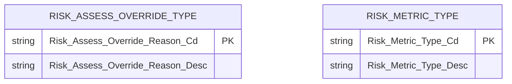

## Banking - Agreement
Entities: 240

```mermaid
erDiagram
    ADD_ON_FACTOR_PARAMETER {
        string Add_On_Factor_Id "PK"
        string Add_On_Factor_Start_Dt ""
        string Add_On_Factor_End_Dt ""
        string Qualifying_Reference_Obligation_Ind ""
        string Add_On_Rate ""
    }
    AGREEMENT_CLASS_ADJUSTMENT_PARAMETER {
        string Agreement_Class_Adjustment_Start_Dttm "PK"
        string Agreement_Class_Adjustment_End_Dttm ""
        string Agreement_Class_Adjustment_Rate ""
    }
    AGREEMENT_CREDIT_RISK_TYPE_METRIC {
        string Agreement_Credit_Risk_Metric_Amt "PK"
        string Agreement_Credit_Risk_Metric_Amt ""
        string Agreement_Credit_Risk_Metric_Rate ""
        string Agreement_Credit_Risk_Metric_Rate ""
        string Agreement_Credit_Risk_Metric_Cnt ""
        string _more "3 more"
    }
    AGREEMENT_GROUP_RISK {
        string Agreement_Group_Loss_Given_Default_Rate "PK"
        string Agreement_Group_Loss_Given_Deflt_Rate ""
        string Agreement_Group_Probability_Default_Rate ""
        string Agreement_Group_Prob_Default_Rate ""
        string Agreement_Group_Effective_Maturity_Cnt ""
        string _more "10 more"
    }
    AGREEMENT_GROUP_RISK_GRADE {
        string Agreement_Group_Risk_Start_Dttm "PK"
        string Agreement_Group_Risk_End_Dttm ""
        string Agreement_Group_Next_Review_Dttm ""
        string Agreement_Group_Risk_Rate_Dttm ""
    }
    AGREEMENT_GROUP_RISK_TYPE_METRIC {
        string Agreement_Group_Risk_Metric_Amt "PK"
        string Market_Risk_Agreement_Group_Metric_Amt ""
        string Agreement_Group_Risk_Metric_Rate ""
        string Market_Risk_Agreement_Group_Metric_Rate ""
        string Agreement_Group_Risk_Metric_Cnt ""
    }
    AGREEMENT_ID_TYPE_JAPAN {
        string Agreement_Identification_Cd "PK"
        string Agreement_Identification_Desc ""
    }
    AGREEMENT_LEASING_ASSET {
        string Asset_Leasing_Value_Amt "PK"
        string Agreement_Asset_Leasing_Amt ""
        string Agreement_Currency_Leasing_Value_Amt ""
        string Agreement_Currency_Asset_Leasing_Amt ""
        string Agreement_Asset_Lease_Residual_Amt ""
        string _more "1 more"
    }
    AGREEMENT_MARKET_RISK_FACTOR {
        string Bank_Risk_Factor_Type_Cd "PK"
        string Investment_Agreement_Risk_Factor_Dttm ""
        string Investment_Agreement_Risk_Factor_Dttm ""
        string Agreement_Risk_Factor_Meas ""
        string Agreement_Risk_Factor_Rate ""
    }
    AGREEMENT_MARKET_RISK_TYPE {
        string Agreement_Market_Risk_Metric_Amt "PK"
        string Agreement_Market_Risk_Metric_Amt ""
        string Agreement_Market_Risk_Metric_Rate ""
        string Agreement_Market_Risk_Metric_Rate ""
        string Agreement_Market_Risk_Metric_Cnt ""
        string _more "3 more"
    }
    AGREEMENT_OBJECTIVE_TYPE {
        string Agreement_Objective_Type_Cd "PK"
        string Agreement_Objective_Type_Desc ""
    }
    AGREEMENT_RISK_HISTORY {
        string Exposure_At_Default_Amt "PK"
        string Exposure_After_Risk_Mitigate_Amt ""
        string Collateral_Haircut_Total_Amt ""
        string Collateral_Value_Amt ""
        string Exposure_Total_Haircut_Amt ""
        string _more "45 more"
    }
    AGREEMENT_RISK_METRIC_INTERNAL_INVESTMENT {
        string Regulatory_Equity_LGD_Rate "PK"
        string Internal_Investment_Risk_Free_Rate ""
        string Regulatory_Scaling_Rate ""
    }
    AGREEMENT_RISK_METRIC_OFF_BALANCE_SHEET {
        string Exposure_Collateral_Currency_Adjusted_Amt "PK"
        string Credit_Conversion_Rate ""
        string Credit_Exposure_Equivalent_Amt ""
        string Off_Balance_Sheet_Overlap_Rate ""
    }
    AGREEMENT_RISK_METRIC_OTC_DERIVATIVE {
        string Potential_Exposure_Add_On_Amt "PK"
    }
    AGREEMENT_RISK_METRIC_PURCHASED_RECEIVABLE {
        string Dilution_Risk_Expected_Loss_Rate "PK"
        string Dilution_Risk_Expected_Loss_Amt ""
    }
    AGREEMENT_RISK_METRIC_SECURITIZATION {
        string Securitization_Credit_Exposure_Amt "PK"
        string Securitization_Drawn_Commitment_Amt ""
        string Securitization_Undrawn_Commitment_Amt ""
        string Capital_Securitization_Exposure_Amt ""
        string Capital_Unsecuritized_Exposure_Amt ""
        string _more "2 more"
    }
    APPLICATION_COLLATERAL_ASSET {
        string Application_Collateral_Asset_Amt "PK"
        string Agreement_Currency_Application_Collateral_Amt ""
    }
    ASSET_CLASS_TO_OBLIGOR_TYPE {
        string Asset_To_Obligor_Start_Dt "PK"
        string Asset_To_Obligor_End_Dt ""
    }
    BALANCE_CATEGORY_TYPE {
        string Balance_Category_Type_Cd "PK"
        string Balance_Category_Type_Desc ""
    }
    BALANCE_CATEGORY_USE_TYPE {
        string Balance_Category_Use_Type_Cd "PK"
        string Balance_Category_Use_Type_Desc ""
    }
    BALANCE_RATE_TYPE {
        string Rate_Type_Cd "PK"
        string Rate_Type_Desc ""
    }
    BALANCE_SHEET_TYPE {
        string Balance_Sheet_Cd "PK"
        string Balance_Sheet_Desc ""
    }
    BANK_TRADE_BOOK_TYPE {
        string Bank_Trade_Book_Cd "PK"
        string Bank_Trade_Book_Desc ""
    }
    BASEL_DEFAULT_STATUS_PARAMETER {
        string Basel_II_Function_Cd "PK"
        string Basel_Default_Status_Start_Dttm ""
        string Basel_Agreement_Status_Default_Ind ""
        string Basel_Default_Status_End_Dttm ""
        string Basel_Default_Desc ""
    }
    BASEL_EXPOSURE_HAIRCUT_PARAMETER {
        string Maturity_Time_Band_Id "PK"
        string Maturity_Time_Band_Scheme_Id "PK"
        string Exposure_Haircut_Parameter_Start_Dttm ""
        string Exposure_Haircut_Parameter_End_Dttm ""
        string Exposure_Supervisor_Haircut_Rate ""
        string _more "3 more"
    }
    BASEL_FUNCTION_TYPE {
        string Basel_Function_Type_Cd "PK"
        string Basel_II_Function_Cd ""
        string Basel_Function_Type_Desc ""
        string Basel_II_Function_Desc ""
    }
    BASEL_II_APPROACH {
        string Basel_II_Approach_Type_Cd "PK"
        string Basel_II_Function_Cd ""
        string Basel_II_Approach_Desc ""
    }
    BASEL_II_ASSET_CLASS {
        string Haircut_Adjusted_Formula_Type_Cd "PK"
        string Basel_II_Asset_Class_Id "PK"
        string Parent_Basel_II_Asset_Class_Id "PK"
    }
    BASEL_II_MINIMUM_LGD_PARAMETER {
        string Minimum_LGD_Parameter_Start_Dt "PK"
        string Minimum_LGD_Parameter_Start_Dt ""
        string Minimum_LGD_Parameter_End_Dt ""
        string Minimum_LGD_Parameter_End_Dt ""
        string Minimum_Threshold_LGD_Rate ""
        string _more "5 more"
    }
    BASEL_IRB_RISK_MITIGANT_TYPE {
        string Basel_IRB_Risk_Mitigant_Cd "PK"
        string Basel_IRB_Risk_Mitigant_Desc ""
    }
    BASEL_OPERATIONAL_RISK_BETA_PARAMETER {
        string Basel_Operational_Risk_Beta_Start_Dttm "PK"
        string Basel_Operational_Risk_Beta_End_Dttm ""
        string Basel_Operational_Risk_Beta_Rate ""
    }
    BASEL_PARAMETER {
        string Basel_Parameter_Id "PK"
        string Basel_Parameter_Id "PK"
        string Basel_Parameter_Start_Dt ""
        string Basel_Parameter_Start_Dt ""
        string Basel_Parameter_Desc ""
        string _more "7 more"
    }
    BOFD_CHECK_IMAGE {
        string Payor_Check_Agreement_Num "PK"
        string Payor_Bank_Check_Transaction_Code_Val ""
    }
    DEBT_RECEIVABLE_AGREEMENT_TYPE ||--o{ PURCHASED_RECEIVABLE_ISSUER_AGREEMENT : "has"
    CHECK_TRANSACTION_TYPE ||--o{ HOME_BANK_CHECK_IMAGE : "has"
    BASEL_DEFAULT_STATUS_PARAMETER ||--o{ INTEREST_RATE_BANKING_BOOK_SUMMARY : "has"
    AGREEMENT_RISK_HISTORY ||--o{ INTEREST_RATE_BANKING_BOOK_SUMMARY : "has"
    SECURITIZATION_POOL_STRUCTURE_TYPE ||--o{ SECURITIZATION_POOL : "has"
    SECURITIZATION_EXPOSURE ||--o{ SECURITIZATION_ROLE : "has"
    SECURITIZATION_CLEAN_UP_CALL_TYPE ||--o{ SECURITIZATION_SELL_AGREEMENT : "has"
    COLLATERAL_AGREEMENT_COVERAGE ||--o{ RISK_MITIGANT_AGREEMENT_ITEM : "has"
    BASEL_DEFAULT_STATUS_PARAMETER ||--o{ BASEL_II_APPROACH : "has"
    TRANCHE_TO_AGREEMENT_ROLE_TYPE ||--o{ TRANCHE_TO_AGREEMENT : "has"
    BASEL_DEFAULT_STATUS_PARAMETER ||--o{ BASEL_FUNCTION_TYPE : "has"
    FINANCIAL_AGREEMENT_TYPE_JAPAN ||--o{ FINANCIAL_AGREEMENT_JAPAN : "has"
    AGREEMENT_ID_TYPE_JAPAN ||--o{ FINANCIAL_AGREEMENT_JAPAN : "has"
```

## Banking - Channel
Entities: 2

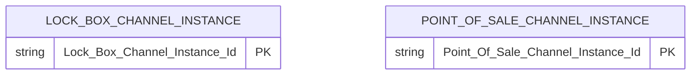

## Banking - Event
Entities: 5

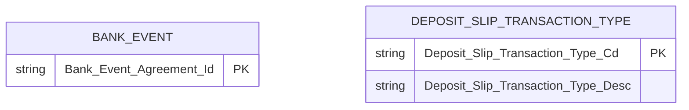

## Banking - Finance
Entities: 7

```mermaid
erDiagram
```

## Banking - Internal Organization
Entities: 6

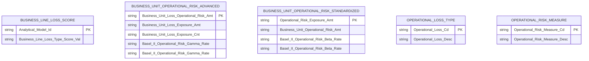

## Banking - Party
Entities: 14

```mermaid
erDiagram
    BANK_ACTUAL_RISK_LOSS {
        string Bank_Actual_Loss_Id "PK"
        string Bank_Actual_Loss_Id "PK"
        string Bank_Risk_Factor_Type_Cd ""
        string Bank_Loss_Reporting_Start_Dt ""
        string Bank_Loss_Reporting_Start_Dt ""
        string _more "5 more"
    }
    BANK_CAPITAL_SUMMARY {
        string Period_Start_Dt "PK"
        string Period_End_Dt ""
        string Share_Capital_Amt ""
        string Reserve_Amt ""
        string Subsidiary_Minority_Interest_Amt ""
        string _more "6 more"
    }
    BANK_LOSS_TYPE {
        string Bank_Loss_Type_Cd "PK"
        string Bank_Loss_Type_Cd ""
        string Bank_Loss_Type_Desc ""
    }
    BASEL_ELIGIBLE_GUARANTEE_PARAMETER {
        string Basel_II_Function_Cd "PK"
        string Basel_Eligibility_Guarantee_Start_Dttm ""
        string Basel_Eligibility_Guarantee_End_Dttm ""
        string Basel_Eligible_Guarantee_Ind ""
    }
    BASEL_MARKET_PARTICIPANT_TYPE {
        string Basel_Market_Participant_Cd "PK"
        string Basel_Market_Participant_Desc ""
    }
    BASEL_ORGANIZATION_TYPE {
        string Basel_Organization_Type_Cd "PK"
        string Basel_Organization_Type_Desc ""
    }
    BUSINESS_TYPE_RISK_FACTOR {
        string Bank_Risk_Factor_Type_Cd "PK"
        string Business_Type_Risk_Factor_Dttm ""
        string Business_Type_Risk_Factor_Dttm ""
        string Business_Type_Risk_Factor_Meas ""
        string Business_Type_Risk_Factor_Rate ""
    }
    CAPITAL_REQUIREMENTS_SUMMARY {
        string Basel_II_Function_Cd "PK"
        string Basel_Portfolio_Product_Group_Id "PK"
        string Period_Start_Dt ""
        string Period_End_Dt ""
        string Credit_Risk_Capital_Amt ""
        string _more "10 more"
    }
    FINANCIAL_RISK_FACTOR {
        string Financial_Risk_Factor_Type_Cd "PK"
        string Bank_Risk_Factor_Type_Cd ""
        string Financial_Risk_Factor_Type_Desc ""
        string Bank_Risk_Factor_Type_Desc ""
        string Underlying_Risk_Factor_Type_Cd ""
    }
    MARKET_PARTICIPANT_PARAMETER {
        string Market_Participant_Start_Dttm "PK"
        string Market_Participant_End_Dttm ""
        string Obligor_Double_Default_Eligibility_Ind ""
        string Guarantor_Double_Default_Eligibility_Ind ""
        string Market_Participant_Preference_RW_Rate ""
    }
    ORGANIZATION_BASEL_APPROACH {
        string Basel_II_Function_Cd "PK"
        string Organization_Basel_Approach_Start_Dt ""
        string Organization_Basel_Approach_End_Dt ""
    }
    PROTECTION_PARTY_TYPE {
        string Protection_Party_Type_Cd "PK"
        string Protection_Party_Type_Desc ""
    }
    BANK_LOSS_TYPE ||--o{ BANK_ACTUAL_RISK_LOSS : "has"
    BANK_CAPITAL_SUMMARY ||--o{ CAPITAL_REQUIREMENTS_SUMMARY : "has"
```

## Banking - Party Asset
Entities: 21

```mermaid
erDiagram
    AGREEMENT_COLLATERAL_ITEM {
        string Agreement_Collateral_Item_Start_Dt "PK"
        string Agreement_Collateral_Item_End_Dt ""
    }
    ASSET_COLLATERAL_ITEM {
        string Asset_Collateral_Item_Start_Dt "PK"
        string Asset_Collateral_Item_End_Dt ""
    }
    ASSET_COLLATERAL_ROLE_TYPE {
        string Asset_Collateral_Role_Type_Cd "PK"
        string Asset_Collateral_Role_Type_Desc ""
    }
    BASEL_COLLATERAL_HAIRCUT_PARAMETER {
        string Collateral_Haircut_Start_Dttm "PK"
        string Maturity_Time_Band_Scheme_Id "PK"
        string Maturity_Time_Band_Id "PK"
        string Collateral_Haircut_End_Dttm ""
        string Collateral_Internal_Haircut_Rate ""
        string _more "4 more"
    }
    BASEL_ELIGIBLE_COLLATERAL_PARAMETER {
        string Basel_II_Function_Cd "PK"
        string Basel_Eligibility_Collateral_Start_Dttm ""
        string Basel_Eligible_Collateral_End_Dttm ""
        string Basel_Collateral_Eligibility_Ind ""
        string Basel_Eligible_Collateral_LGD_Rate ""
    }
    COLLATERAL_ITEM {
        string Collateral_Item_Id "PK"
        string Risk_Mitigant_Item_Id "PK"
        string Collateral_Item_Host_Id "PK"
    }
    COLLATERAL_ITEM_ADJUSTMENT {
        string Collateral_Value_Adjusted_Amt "PK"
        string Asset_Currency_Collateral_Adjusted_Amt ""
        string Collateral_Value_Adjusted_Rate ""
        string Collateral_Value_Adjusted_Cnt ""
    }
    COLLATERAL_ITEM_CLASS_XREF {
        string Risk_Mitigant_Item_Id "PK"
        string Collateral_Item_Class_Start_Dt ""
        string Risk_Mitigant_Item_Class_Start_Dt ""
        string Collateral_Item_Class_End_Dt ""
        string Risk_Mitigant_Item_Class_End_Dt ""
    }
    COLLATERAL_ITEM_GROUP {
        string Collateral_Item_Group_Id "PK"
        string Collateral_Item_Group_Name ""
        string Collateral_Item_Group_Limit_Amt ""
        string Collateral_Item_Group_Start_Dt ""
        string Collateral_Item_Group_End_Dt ""
    }
    COLLATERAL_ITEM_GROUPED {
        string Risk_Mitigant_Item_Id "PK"
        string Collateral_Item_Grouped_Start_Dt ""
        string Collateral_Item_Grouped_End_Dt ""
    }
    COLLATERAL_ITEM_RISK_METRIC {
        string Collateral_Item_Metric_Calculation_Dt "PK"
        string Estimated_Holding_Period_Day_Num ""
        string Actual_Holding_Period_Day_Num ""
        string Collateral_Item_Effective_Maturity_Cnt ""
        string Remargining_Frequency_Time_Period_Cd ""
        string _more "1 more"
    }
    COLLATERAL_ITEM_STATUS {
        string Risk_Mitigant_Item_Id "PK"
        string Collateral_Item_Status_Start_Dt ""
        string Collateral_Item_Status_End_Dt ""
    }
    COLLATERAL_ITEM_STATUS_TYPE {
        string Collateral_Item_Status_Cd "PK"
        string Collateral_Item_Status_Desc ""
    }
    COLLATERAL_ITEM_TYPE {
        string Collateral_Item_Type_Cd "PK"
        string Collateral_Item_Type_Desc ""
    }
    COLLATERAL_ITEM_VALUE {
        string Risk_Mitigant_Item_Id "PK"
        string Collateral_Item_Value_End_Dt ""
        string Risk_Mitigant_Item_Value_End_Dt ""
        string Collateral_Item_Evaluator_Party_Id ""
        string Collateral_Item_Total_Adjusted_Amt ""
        string _more "14 more"
    }
    ELIGIBLE_RISK_MITIGANT_TYPE {
        string Eligible_Risk_Mitigant_Cd "PK"
        string Eligible_Risk_Mitigant_Desc ""
    }
    INSPECTION_RESULT_TYPE {
        string Inspection_Result_Type_Cd "PK"
        string Inspection_Result_Type_Desc ""
    }
    PARTY_ASSET_INTERNAL_ID_TYPE {
        string Party_Asset_Internal_Id_Cd "PK"
        string Party_Asset_Internal_Id_Desc ""
        string Over_The_Counter_Channel_Instance_Id "PK"
    }
    PARTY_ASSET_PRICE_SENSITIVITY {
        string Sensitivity_Cd "PK"
        string Party_Asset_Sensitivity_Dt ""
        string Party_Asset_Sensitivity_Dt ""
        string Party_Asset_Sensitivity_Rate ""
    }
    PARTY_ASSET_SENSITIVITY_TYPE {
        string Party_Asset_Sensitivity_Cd "PK"
        string Sensitivity_Cd ""
        string Party_Asset_Sensitivity_Desc ""
        string Party_Asset_Sensitivity_Desc ""
    }
    PARTY_ASSET_PRICE_SENSITIVITY ||--o{ PARTY_ASSET_SENSITIVITY_TYPE : "has"
```

## Banking - Product
Entities: 11

```mermaid
erDiagram
    BANKING_LINE_OF_BUSINESS_TYPE {
        string Banking_Line_Of_Business_Cd "PK"
        string Banking_Line_Of_Business_Desc ""
    }
    BANKING_PRODUCT_TYPE {
        string Banking_Product_Type_Cd "PK"
        string Banking_Product_Type_Desc ""
    }
    BASEL_EQUITY_RISK_WEIGHT_PARAMETER {
        string Basel_Equity_Parameter_Start_Dttm "PK"
        string Basel_Equity_Parameter_End_Dttm ""
        string Basel_Equity_Simple_RW_Rate ""
        string Basel_Equity_Internal_RW_Rate ""
        string Basel_Equity_PD_LGD_RW_Rate ""
    }
    BASEL_RETAIL_DEFAULT_PARAMETER {
        string Basel_Retail_Default_Start_Dttm "PK"
        string Basel_Retail_Default_End_Dttm ""
        string Basel_Retail_Default_Ind ""
    }
    CARD_ASSOCIATION_TYPE {
        string Card_Association_Type_Cd "PK"
        string Card_Association_Type_Desc ""
    }
    INTEREST_INDEX_RISK_FACTOR {
        string Bank_Risk_Factor_Type_Cd "PK"
        string Interest_Index_Risk_Factor_Dttm ""
        string Interest_Rate_Index_Risk_Factor_Dttm ""
        string Interest_Index_Risk_Factor_Meas ""
        string Interest_Rate_Index_Risk_Factor_Rate ""
    }
    PRODUCT_MINIMUM_HOLDING_PERIOD_PARAMETER {
        string Minimum_Holding_Start_Dt "PK"
        string Minimum_Holding_End_Dt ""
        string Minimum_Holding_Time_Period_Cd ""
        string Minimum_Holding_Period_Num ""
        string Remargining_Minimum_Hold_Time_Cd ""
    }
    RISK_FACTOR_INSTRUMENT {
        string Risk_Factor_Id "PK"
        string Underlying_Risk_Factor_Id "PK"
        string Risk_Factor_Maturity_Cnt ""
        string Risk_Factor_Maturity_UOM_Cd ""
    }
    SPECIAL_LENDING_SLOTTING_PARAMETER {
        string Slotting_Parameter_Start_Dttm "PK"
        string Slotting_Parameter_End_Dttm ""
        string Slotting_Expected_Loss_Risk_Weight_Rate ""
        string Slotting_Unexpected_Loss_Risk_Rate ""
    }
```

## Foundation
Entities: 174

```mermaid
erDiagram
    AGREEMENT_GROUP_SUBJECT {
        string Agreement_Group_Id "PK"
    }
    ANALYTICAL_MODEL {
        string Model_Id "PK"
        string Model_Name ""
        string Model_Desc ""
        string Model_Version_Num ""
        string Model_Source_Party_Id ""
        string _more "3 more"
    }
    ANALYTICAL_MODEL_GROUP {
        string Analytical_Model_Group_Id "PK"
        string Analytical_Model_Group_Desc ""
    }
    ANALYTICAL_MODEL_RISK_FACTOR {
        string Analytical_Model_Risk_Start_Dttm "PK"
        string Analytical_Model_Risk_End_Dttm ""
    }
    ANALYTICAL_MODEL_RISK_FACTOR_ROLE {
        string Analytical_Model_Risk_Role_Cd "PK"
        string Analytical_Model_Risk_Role_Desc ""
        string Modulel_Template ""
        string EntityNameMappingOption ""
        string DomainNameMappingOption ""
        string _more "6 more"
    }
    ANALYTICAL_MODEL_RUN_REVIEW {
        string Analytical_Model_Id "PK"
        string Analytical_Model_Review_Dt ""
        string Reviewer_Party_Id "PK"
    }
    ANALYTICAL_MODEL_STATUS {
        string Model_Status_Start_Dt "PK"
        string Model_Status_End_Dt ""
    }
    ANALYTICAL_MODEL_TO_GROUP {
        string Model_To_Group_Start_Dttm "PK"
        string Model_To_Group_End_Dttm ""
        string Banking___Agreement.Risk_Position ""
        string Letter ""
        string Letter ""
    }
    ANALYTICAL_MODEL_TO_RISK_GRADE {
        string Analytical_Model_Risk_Grade_Start_Dt "PK"
        string Analytical_Model_Risk_Grade_End_Dt ""
    }
    ANALYTICAL_MODEL_VALUE {
        string Analytical_Model_Value_Id "PK"
        string Analytical_Model_Start_Dttm ""
        string Analytical_Model_End_Dttm ""
        string Analytical_Model_Value_Desc ""
        string Analytical_Model_Allowed_Val ""
        string _more "5 more"
    }
    ASSUMPTION_SET {
        string Assumption_Rate "PK"
        string Assumption_Amt ""
        string Assumption_Val ""
        string Western ""
        string Arial ""
        string _more "16 more"
    }
    BUSINESS_DAY_CONVENTION_TYPE {
        string Business_Day_Convention_Cd "PK"
        string Business_Day_Convention_ID ""
        string Business_Day_Convention_Desc ""
        string Business_Day_Convention_Description ""
    }
    CALENDAR_TYPE {
        string Calendar_Type_Cd "PK"
        string Calendar_Type_Desc ""
    }
    COST_TYPE {
        string Cost_Type_Cd "PK"
        string Cost_Desc ""
        string Parent_Cost_Type_Cd ""
    }
    CREDIT_INQUIRY_REASON_TYPE {
        string Credit_Inquiry_Reason_Cd "PK"
        string Credit_Inquiry_Reason_Desc ""
    }
    CREDIT_RATING_TYPE {
        string Credit_Rating_Cd "PK"
        string Credit_Rating_Desc ""
    }
    CURRENCY {
        string Currency_Name "PK"
        string Currency_Rounding_Decimal_Cnt ""
        string Exchange_Rate_Unit_Cnt ""
        string Currency_Cd ""
    }
    CURRENCY_DENOMINATION_TYPE {
        string Currency_Denomination_Type_Cd "PK"
        string Currency_Denomination_Type_Desc ""
    }
    CURRENCY_TRANSLATION_RATE {
        string Currency_Translation_Rate_Start_Dttm "PK"
        string Currency_Translation_Rate_End_Dttm ""
        string Target_To_Source_Currency_Rate ""
        string Source_To_Target_Currency_Rate ""
        string Target_Currency_Cd ""
        string _more "1 more"
    }
    CURRENCY_TRANSLATION_RATE_TYPE {
        string Currency_Translation_Rate_Type_Cd "PK"
        string Currency_Translation_Rate_Type_Desc ""
    }
    CURRENCY_USE_TYPE {
        string Currency_Use_Cd "PK"
        string Currency_Cd_Desc ""
    }
    CUSTOM_CALENDAR_DAY {
        string Custom_Calendar_Day_Of_Month_Num "PK"
        string Custom_Calendar_Day_Of_Year_Num ""
    }
    CUSTOM_CALENDAR_MONTH {
        string Custom_Calendar_Month_Id "PK"
        string Custom_Calendar_Month_Desc ""
    }
    CUSTOM_CALENDAR_QUARTER {
        string Custom_Calendar_Quarter_Id "PK"
        string Custom_Calendar_Quarter_Desc ""
    }
    CUSTOM_CALENDAR_WEEK {
        string Custom_Calendar_Week_Id "PK"
        string Custom_Calendar_Week_Desc ""
    }
    CUSTOM_CALENDAR_YEAR {
        string Custom_Calendar_Year_Id "PK"
        string Custom_Calendar_Year_Desc ""
    }
    DATA_QUALITY_TYPE {
        string Data_Quality_Cd "PK"
        string Data_Quality_Desc ""
    }
    DATA_SOURCE_TYPE {
        string Data_Source_Type_Cd "PK"
        string Data_Source_Type_Desc ""
    }
    DAY_OF_WEEK {
        string Day_Of_Week_Num "PK"
        string Day_Of_Week_Name ""
    }
```

## Foundation - Agreement
Entities: 252

```mermaid
erDiagram
    ACCESS_DEVICE {
        string Access_Device_Id "PK"
        string Access_Device_Interactive_Ind ""
    }
    ACCESS_DEVICE_LIMIT {
        string Access_Device_Limit_Start_Dt "PK"
        string Access_Device_Limit_End_Dt ""
        string Access_Device_Limit_Val ""
        string Access_Device_Limit_Amt ""
    }
    ACCESS_DEVICE_METHOD_TYPE {
        string Access_Device_Method_Type_Cd "PK"
        string Access_Device_Method_Type_Desc ""
    }
    ACCESS_DEVICE_PIN {
        string Access_Device_PIN_Issue_Dttm "PK"
        string Access_Device_PIN_Num ""
        string Access_Device_PIN_Mailing_Dttm ""
        string Access_Device_Customer_Ind ""
    }
    ACCESS_DEVICE_PIN_REASON_TYPE {
        string Access_Device_PIN_Reason_Cd "PK"
        string Access_Device_PIN_Reason_Desc ""
    }
    ACCESS_DEVICE_REASON_TYPE {
        string Access_Device_Reason_Cd "PK"
        string Access_Device_Reason_Desc ""
    }
    ACCESS_DEVICE_RELATED_TYPE {
        string Access_Device_Relate_Type_Desc "PK"
    }
    ACCESS_DEVICE_STATUS {
        string Access_Device_Status_Start_Dttm "PK"
        string Access_Device_Status_End_Dttm ""
    }
    ACCESS_DEVICE_STATUS_TYPE {
        string Access_Device_Status_Cd "PK"
        string Access_Device_Status_Desc ""
    }
    ACCESS_DEVICE_SUBTYPE {
        string Access_Device_Subtype_Cd "PK"
        string Access_Device_Subtype_Desc ""
    }
    ACCESS_DEVICE_VERIFY_TYPE {
        string Access_Device_Verify_Type_Cd "PK"
        string Access_Device_Verify_Type_Desc ""
    }
    ACCESS_MEDIUM_TYPE {
        string Access_Medium_Type_Cd "PK"
        string Access_Medium_Type_Desc ""
    }
    ACCOUNT {
        string Account_Id "PK"
        string Account_Num ""
        string Account_Name ""
        string Account_Open_Dt ""
        string Account_Close_Dt ""
        string _more "2 more"
    }
    ACCOUNT_INVOLVEMENT_SUBTYPE {
        string Account_Involvement_Subtype_Cd "PK"
        string Account_Involvement_Subtype_Desc ""
    }
    ACCOUNT_METRIC {
        string Account_Metric_Amt "PK"
        string Account_Metric_Cnt ""
        string Account_Metric_Dttm ""
        string Account_Metric_Unit_Of_Measure_Cd ""
        string Account_Metric_Time_Period_Cd ""
        string _more "1 more"
    }
    ACCOUNT_METRIC_TYPE {
        string Account_Metric_Type_Cd "PK"
        string Account_Metric_Type_Desc ""
    }
    ACCOUNT_PURPOSE_SUBTYPE {
        string Account_Purpose_Subtype_Cd "PK"
        string Account_Purpose_Subtype_Desc ""
    }
    ACCOUNT_RENEWAL {
        string Account_Renewal_Actual_Start_Dttm "PK"
        string Account_Renewal_Planned_Start_Dttm ""
        string Account_Renewal_Planned_Expiration_Dttm ""
        string Account_Renewal_Actual_Expiration_Dttm ""
    }
    ACCOUNT_TYPE {
        string Account_Type_Cd "PK"
        string Account_Type_Desc ""
    }
    ACCOUNTING_CURRENCY {
        string Business_Unit_Party_Id "PK"
        string Accounting_Currency_Start_Dttm ""
        string Accounting_Currency_End_Dttm ""
        string Accounting_Currency_Cd ""
    }
    ACCOUNTING_TYPE {
        string Accounting_Type_Cd "PK"
        string Accounting_Type_Desc ""
    }
    AGREEMENT {
        string Agreement_Id "PK"
        string Agreement_Source_Cd ""
        string Agreement_Current_Status_Cd ""
        string Agreement_Current_Status_Reason_Cd ""
        string Agreement_Open_Dttm ""
        string _more "10 more"
    }
    AGREEMENT_ABUSE {
        string Agreement_Abuse_Dt "PK"
        string Agreement_Abuse_Amt ""
        string Agreement_Currency_Abuse_Amt ""
        string Abuse_Occurred_Currency_Amt ""
        string Abuse_Occurred_Currency_Cd ""
    }
    AGREEMENT_ACCESS_DEVICE {
        string Agreement_Access_Device_Type_Cd "PK"
        string Agreement_Access_Device_Start_Dt ""
        string Agreement_Access_Device_End_Dt ""
    }
    AGREEMENT_ACCESS_DEVICE_FEATURE {
        string Agreement_Device_Feature_Start_Dt "PK"
        string Agreement_Device_Feature_End_Dt ""
    }
    AGREEMENT_ACCESS_DEVICE_TYPE {
        string Agreement_Access_Device_Type_Cd "PK"
        string Agreement_Access_Device_Desc ""
    }
    AGREEMENT_AGREEMENT_CLASS_XREF {
        string Agreement_Class_Start_Dt "PK"
        string Agreement_Class_End_Dt ""
    }
    AGREEMENT_AGREEMENT_GROUP {
        string Agreement_Agreement_Group_Start_Dt "PK"
        string Agreement_Agreement_Group_End_Dt ""
        string Agreement_Agreement_Group_Subtype_Cd ""
    }
    AGREEMENT_AGREEMENT_GROUP_SUBTYPE {
        string Agreement_Agreement_Group_Subtype_Cd "PK"
        string Agreement_Agreement_Group_Subtype_Desc ""
    }
    AGREEMENT_APPLICATION {
        string Asset_Role_Cd "PK"
        string Agreement_Application_Start_Dt ""
        string Agreement_Application_End_Dt ""
    }
    AGREEMENT_APPLICATION_ROLE {
        string Agreement_Application_Role_Cd "PK"
        string Asset_Role_Cd ""
        string Agreement_Application_Role_Desc ""
        string Asset_Role_Desc ""
    }
    AGREEMENT_ASSET {
        string Agreement_Asset_Start_Dt "PK"
        string Agreement_Asset_End_Dt ""
    }
    AGREEMENT_BALANCE_TYPE_METRIC {
        string Agreement_Metric_Type_Cd "PK"
        string Risk_Metric_Type_Cd ""
        string Agreement_Currency_Balance_Type_Metric_Amt ""
        string Agreement_Currency_Balance_Summary_Amt ""
        string Agreement_Balance_Type_Metric_End_Dttm ""
        string _more "9 more"
    }
    AGREEMENT_CHANNEL {
        string Agreement_Channel_Start_Dt "PK"
        string Agreement_Channel_Allocation_Pct ""
        string Agreement_Channel_Allocation_Amt ""
        string Agreement_Channel_End_Dt ""
    }
    AGREEMENT_CHANNEL_ROLE_TYPE {
        string Agreement_Channel_Role_Type_Cd "PK"
        string Agreement_Channel_Role_Type_Desc ""
    }
    AGREEMENT_CHANNEL_TYPE {
        string Agreement_Channel_Type_Start_Dt "PK"
        string Agreement_Channel_Type_End_Dt ""
        string EntityNameMappingOption ""
        string DomainNameMappingOption ""
        string AttributeNameMappingOption ""
        string _more "64 more"
    }
    AGREEMENT_CHART_OF_ACCOUNTS {
        string Agreement_Chart_Of_Accounts_Start_Dt "PK"
        string Agreement_Chart_Of_Accounts_End_Dt ""
    }
    AGREEMENT_CLASS_RISK_GRADE {
        string Agreement_Class_Risk_Start_Dttm "PK"
        string Agreement_Class_Risk_Grade_Start_Dt ""
        string Agreement_Class_Risk_End_Dttm ""
        string Agreement_Class_Risk_Grade_End_Dt ""
        string Agreement_Class_Risk_Rate_Dttm ""
    }
    AGREEMENT_FEATURE_RELATED ||--o{ AGREEMENT_FEATURE_METRIC : "has"
    ENVELOPE_MESSAGE_TYPE ||--o{ STATEMENT : "has"
    AGREEMENT_FEATURE_RELATED ||--o{ APPLICATION_FEATURE : "has"
    AGREEMENT_FEATURE_RELATED ||--o{ AGREEMENT_FEATURE : "has"
    AGREEMENT_PARTY_FEATURE ||--o{ AGREEMENT_FEATURE : "has"
    AGREEMENT_GROUP_TYPE ||--o{ AGREEMENT_GROUP_TYPE_XREF : "has"
    AGREEMENT_FEATURE_RELATED ||--o{ AGREEMENT_FEATURE_ROLE_TYPE : "has"
    AGREEMENT_FEATURE_RELATED ||--o{ AGREEMENT_PRODUCT_FEATURE : "has"
    AGREEMENT_PARTY_FEATURE ||--o{ AGREEMENT_PRODUCT_FEATURE : "has"
    AGREEMENT_GROUP_SCORE ||--o{ AGREEMENT_GROUP : "has"
    AGREEMENT_GROUP_REASON_TYPE ||--o{ AGREEMENT_GROUP : "has"
    AGREEMENT_FEATURE_RELATED ||--o{ QUOTATION_FEATURE_RELATED : "has"
    AGREEMENT_PARTY_FEATURE ||--o{ QUOTATION_FEATURE_RELATED : "has"
    AGREEMENT_AGREEMENT_GROUP_SUBTYPE ||--o{ AGREEMENT_AGREEMENT_GROUP : "has"
    AGREEMENT_FEATURE_RELATED ||--o{ QUOTATION_FEATURE : "has"
    AGREEMENT_PARTY_FEATURE ||--o{ QUOTATION_FEATURE : "has"
    AGREEMENT_OBTAINED_TYPE ||--o{ AGREEMENT : "has"
    AGREEMENT_METRIC_PROJECTION ||--o{ AGREEMENT_BALANCE_TYPE_METRIC : "has"
    AGREEMENT_FEATURE_RELATED ||--o{ APPLICATION_FEATURE_RELATED : "has"
    AGREEMENT_METRIC_PROJECTION ||--o{ AGREEMENT_METRIC_TYPE : "has"
    LOYALTY_PROGRAM_PARTY ||--o{ LOYALTY_PROGRAM : "has"
    AGREEMENT_PRODUCT_FEATURE_RELATED ||--o{ AGREEMENT_PRODUCT_ROLE_TYPE : "has"
    UNITED_STATES_BANK_ACCOUNT_IDENTIFIER ||--o{ AGREEMENT_IDENTIFICATION : "has"
    AGREEMENT_IDENTIFICATION_CATEGORY ||--o{ AGREEMENT_IDENTIFICATION : "has"
    AGREEMENT_FEATURE_RELATED ||--o{ AGREEMENT_PRODUCT_FEATURE_RELATED : "has"
    APPLICATION_CHECKLIST_STATUS_TYPE ||--o{ APPLICATION_CHECKLIST : "has"
    AGREEMENT_IDENTIFICATION ||--o{ ACCOUNT : "has"
```

## Foundation - Campaign
Entities: 266

```mermaid
erDiagram
    AD_CONTACT_XREF {
        string Contact_Event_Id "PK"
    }
    AD_DELIVERY_TYPE {
        string Ad_Delivery_Type_Cd "PK"
        string Ad_Delivery_Type_Desc ""
    }
    AD_GROUP_CAMPAIGN_XREF {
        string Ad_Group_Id "PK"
    }
    AD_IMPRESSION_SUMMARY {
        string Ad_Impression_Summary_Statistics_Dttm "PK"
        string Impressions_Viewed_Cnt ""
        string Impression_Click_Through_Cnt ""
        string Impression_Statistics_Provider_Party_Id ""
    }
    AD_ORDER {
        string Ad_Order_Id "PK"
        string Parent_Ad_Order_Id "PK"
        string Ad_Order_Dttm ""
        string Ad_Order_Name ""
        string Requested_Ad_Placement_End_Dttm ""
        string _more "6 more"
    }
    AD_ORDER_COMMISSION {
        string Sales_Party_Id "PK"
        string Ad_Order_Commission_Pct ""
        string Ad_Order_Commission_Fixed_Amt ""
    }
    AD_ORDER_DELIVERY_SUBTYPE {
        string Ad_Order_Delivery_Subtype_Cd "PK"
        string Ad_Order_Delivery_Subtype_Desc ""
    }
    AD_ORDER_EXPENSE_FORECAST {
        string Ad_Order_Expense_Forecast_End_Dt "PK"
        string Ad_Order_Expense_Forecast_Amt ""
        string Ad_Order_Expense_Actual_Amt ""
    }
    AD_ORDER_MAKE_GOOD {
        string Make_Good_Reason_Cd "PK"
        string Ad_Order_Make_Good_Subtype_Cd ""
    }
    AD_ORDER_MAKE_GOOD_REASON_TYPE {
        string Make_Good_Reason_Cd "PK"
        string Make_Good_Reason_Desc ""
    }
    AD_ORDER_MAKE_GOOD_REFUND {
        string Refund_Item_Qty "PK"
        string Refund_Item_Amt ""
        string Insurance___Agreement.Line_of_Business ""
        string Letter ""
        string Letter ""
    }
    AD_ORDER_MAKE_GOOD_SUBTYPE {
        string Ad_Order_Make_Good_Subtype_Cd "PK"
        string Ad_Order_Make_Good_Subtype_Desc ""
    }
    AD_ORDER_ONLINE {
        string Total_Maximum_Impression_Cnt "PK"
        string Total_Maximum_Click_Cnt ""
        string Total_Maximum_Conversion_Cnt ""
        string Total_Maximum_Amt ""
        string Daily_Maximum_Impression_Cnt ""
        string _more "4 more"
    }
    AD_ORDER_ONLINE_SUBTYPE {
        string Ad_Order_Online_Subtype_Cd "PK"
        string Ad_Order_Online_Subtype_Desc ""
    }
    AD_ORDER_PARTY_ROLE {
        string Ad_Order_Party_Role_Cd "PK"
        string Ad_Order_Party_Role_Desc ""
    }
    AD_ORDER_PRINT_MEDIUM {
        string Print_Page_Type_Cd "PK"
        string Print_Page_Position_Cd ""
    }
    AD_ORDER_STATUS {
        string Ad_Order_Status_Start_Dttm "PK"
        string Ad_Order_Status_End_Dttm ""
    }
    AD_ORDER_STATUS_TYPE {
        string Ad_Order_Status_Type_Cd "PK"
        string Ad_Order_Status_Type_Desc ""
    }
    AD_ORDER_TRADITIONAL {
        string Client_Cost_Amt "PK"
        string Market_Cost_Amt ""
        string Market_Level_Name ""
        string Rate_Card_Cost_Amt ""
        string Vendor_Cost_Amt ""
    }
    AD_ORDER_TRADITIONAL_SUBTYPE {
        string Ad_Order_Traditional_Subtype_Cd "PK"
        string Ad_Order_Traditional_Subtype_Desc ""
    }
    AD_ORDER_TYPE {
        string Ad_Order_Type_Cd "PK"
        string Ad_Order_Type_Desc ""
    }
    AD_ORDER_WEB_MEDIUM {
        string Web_Page_Type_Cd "PK"
        string Web_Page_Position_Cd ""
    }
    AD_PLACEMENT {
        string Ad_Placement_Id "PK"
        string Ad_Placement_Visit_Id "PK"
        string Secondary_Segment_Id "PK"
        string Primary_Segment_Id ""
    }
    AD_PLACEMENT_PRINT_MEDIUM {
        string Print_Ad_Placement_Page_Type_Cd "PK"
        string Ad_Placement_Page_Num ""
        string Print_Ad_Placement_Page_Position_Cd ""
        string Foundation___Campaign.Advertisement_Traditional_Performance ""
        string Letter ""
        string _more "1 more"
    }
    AD_PLACEMENT_SUBTYPE {
        string Ad_Placement_Subtype_Cd "PK"
        string Ad_Placement_Subtype_Desc ""
    }
    AD_SPACE_ITEM {
        string Ad_Space_Item_Id "PK"
        string Ad_Space_Item_Name ""
        string Ad_Space_Item_Desc ""
    }
    AD_STATUS {
        string Ad_Status_Start_Dttm "PK"
        string Ad_Status_End_Dttm ""
        string Ad_Status_Type_Cd ""
    }
    AD_STATUS_TYPE {
        string Ad_Status_Type_Cd "PK"
        string Ad_Status_Type_Desc ""
    }
    AD_SUBCATEGORY {
        string Ad_Subcategory_Cd "PK"
        string Ad_Subcategory_Desc ""
    }
    CAMPAIGN_COLLATERAL ||--o{ COMMUNICATION_COLLATERAL : "has"
    COMMUNICATION_COLLATERAL_TYPE ||--o{ COMMUNICATION_COLLATERAL : "has"
    OPPORTUNITY_ASSET ||--o{ OPPORTUNITY_ASSET_ROLE_TYPE : "has"
    OPPORTUNITY_STATUS_TYPE ||--o{ OPPORTUNITY_DOCUMENT_ROLE_TYPE : "has"
    OPPORTUNITY_STATUS_TYPE ||--o{ SALES_METHOD_TYPE : "has"
    OPPORTUNITY_STATUS_TYPE ||--o{ OPPORTUNITY_STRATEGIC_VALUE_TYPE : "has"
    OPPORTUNITY_STATUS_TYPE ||--o{ OPPORTUNITY_LEAD_TYPE : "has"
    OPPORTUNITY_STATUS_TYPE ||--o{ OPPORTUNITY_TYPE : "has"
    OPPORTUNITY_STATUS_TYPE ||--o{ OPPORTUNITY_ISSUE_RESOLVE_TYPE : "has"
    OPPORTUNITY_STATUS_TYPE ||--o{ COMPETE_LEVEL_TYPE : "has"
    OPPORTUNITY_STATUS_TYPE ||--o{ PARTY_OPPORTUNITY_ROLE_TYPE : "has"
    OPPORTUNITY_STATUS_TYPE ||--o{ OPPORTUNITY_VISIBLE_TYPE : "has"
    OPPORTUNITY_STATUS_TYPE ||--o{ DEAL_COMPLETE_DAY_TYPE : "has"
    OPPORTUNITY_STATUS_TYPE ||--o{ DECISION_LEVEL_TYPE : "has"
    OPPORTUNITY_STATUS_TYPE ||--o{ OPPORTUNITY_ISSUE_TYPE : "has"
    OPPORTUNITY_STATUS_TYPE ||--o{ OPPORTUNITY_ISSUE : "has"
    OPPORTUNITY_COMPETITOR ||--o{ OPPORTUNITY_PARTY : "has"
    OPPORTUNITY_STATUS_TYPE ||--o{ OPPORTUNITY : "has"
    CAMPAIGN_AGREEMENT_ROLE_TYPE ||--o{ CAMPAIGN_AGREEMENT : "has"
    OFFER_TYPE ||--o{ OFFER : "has"
    PROMOTION_OFFER_TYPE ||--o{ PROMOTION_OFFER : "has"
    PROMOTION_PROSPECT ||--o{ PROMOTION_PARTY : "has"
    OPPORTUNITY_STATUS_TYPE ||--o{ OPPORTUNITY_COMPETITOR : "has"
    INCENTIVE ||--o{ CAMPAIGN_CELL : "has"
    AD_ORDER_TYPE ||--o{ AD_ORDER : "has"
    AD_ORDER_ONLINE_SUBTYPE ||--o{ AD_ORDER_ONLINE : "has"
    AD_STATUS_TYPE ||--o{ AD_STATUS : "has"
    AD_ORDER_MAKE_GOOD_SUBTYPE ||--o{ AD_ORDER_MAKE_GOOD : "has"
    PROMOTION_SCRIPTED_MESSAGE_XREF ||--o{ IMPRESSION_ACTIVITY_TYPE : "has"
```

## Foundation - Channel
Entities: 122

```mermaid
erDiagram
    AD_NETWORK {
        string Ad_Network_Id "PK"
        string Ad_Network_Desc ""
        string Controlling_Party_Id "PK"
    }
    ATM_CHANNEL_INSTANCE {
        string Network_Unit_Cost_Amt "PK"
    }
    BILLBOARD_CHANNEL_INSTANCE {
        string Billboard_Channel_Instance_Id "PK"
    }
    BROWSER_APPLICATION_TYPE {
        string Browser_Application_Cd "PK"
        string Browser_Application_Desc ""
    }
    BROWSER_IDENTIFICATION {
        string Browser_Identification_Id "PK"
        string Browser_Identification_Hardware_Desc ""
    }
    BROWSER_VERSION {
        string Browser_Application_Version_Num "PK"
    }
    CALL_CENTER_TERMINAL_CHANNEL_INSTANCE {
        string Call_Center_Channel_Instance_Id "PK"
    }
    CALL_CENTER_TYPE {
        string Call_Center_Type_Cd "PK"
        string Call_Center_Type_Desc ""
    }
    CAPACITY_TYPE {
        string Capacity_Type_Cd "PK"
        string Capacity_Type_Desc ""
    }
    CHANNEL_CAPACITY {
        string Channel_Capacity_Start_Dt "PK"
        string Channel_Capacity_Num ""
        string Channel_Capacity_End_Dt ""
    }
    CHANNEL_CHANNEL_CLASS_XREF {
        string Party_Classification_Cd "PK"
        string Channel_Class_Start_Dt ""
        string Party_Class_Start_Dt ""
        string Party_Class_Value_Cd ""
        string Channel_Class_End_Dt ""
        string _more "1 more"
    }
    CHANNEL_CLASS_SCHEME_TYPE {
        string Channel_Class_Cd "PK"
        string Party_Classification_Cd ""
        string Channel_Class_Desc ""
        string Party_Classification_Desc ""
        string Parent_Channel_Class_Cd ""
        string _more "5 more"
    }
    CHANNEL_CLASS_VALUE {
        string Channel_Class_Value_Cd "PK"
        string Party_Class_Value_Cd ""
        string Party_Classification_Cd ""
        string Party_Classification_Cd ""
        string Parent_Channel_Class_Value_Cd ""
        string _more "10 more"
    }
    CHANNEL_COST {
        string Channel_Cost_Start_Dttm "PK"
        string Channel_Cost_End_Dttm ""
        string Channel_Cost_Time_Period_Cd ""
        string Channel_Cost_Amt ""
    }
    CHANNEL_DEMOGRAPHIC {
        string Channel_Demographic_Start_Dt "PK"
        string Channel_Demographic_End_Dt ""
        string Channel_Demographic_Num ""
        string Channel_Demographic_Val ""
    }
    CHANNEL_EVENT {
        string Channel_Event_Start_Dt "PK"
        string Channel_Event_Start_Tm ""
        string Channel_Event_End_Dt ""
        string Channel_Event_End_Tm ""
    }
    CHANNEL_EVENT_REASON_TYPE {
        string Channel_Event_Reason_Cd "PK"
        string Channel_Event_Reason_Desc ""
    }
    CHANNEL_FEATURE {
        string Channel_Feature_Id "PK"
        string Channel_Feature_Start_Dt ""
        string Agreement_Feature_Start_Dt ""
        string Channel_Feature_End_Dt ""
        string Agreement_Feature_End_Dt ""
        string _more "6 more"
    }
    CHANNEL_INSTANCE {
        string Channel_Instance_Id "PK"
        string Channel_Instance_Name ""
        string Channel_Instance_Start_Dt ""
        string Channel_Instance_End_Dt ""
        string Alternate_Channel_Type_Cd ""
    }
    CHANNEL_INSTANCE_LOCATOR {
        string Channel_Instance_Locator_Start_Dt "PK"
        string Channel_Instance_Locator_End_Dt ""
    }
    CHANNEL_INSTANCE_LOCATOR_REASON {
        string Channel_Instance_Locator_Reason_Cd "PK"
        string Channel_Instance_Locator_Reason_Desc ""
    }
    CHANNEL_INSTANCE_SITE_XREF {
        string Channel_Instance_Site_Start_Dt "PK"
        string Channel_Instance_Site_End_Dt ""
    }
    CHANNEL_INSTANCE_SUBTYPE {
        string Channel_Instance_Subtype_Cd "PK"
        string Alternate_Channel_Type_Cd ""
        string Channel_Instance_Subtype_Desc ""
        string Alternate_Channel_Type_Desc ""
    }
    CHANNEL_OPERATING_HOURS {
        string Channel_Hours_Change_Dt "PK"
    }
    CHANNEL_PROCESSING_TYPE {
        string Channel_Processing_Cd "PK"
        string Channel_Processing_Desc ""
    }
    CHANNEL_PROFIT {
        string Channel_Profit_Start_Dttm "PK"
        string Channel_Profit_End_Dttm ""
        string Channel_Profit_Amt ""
    }
    CHANNEL_REPLENISHMENT {
        string Replenishment_Amt "PK"
    }
    CHANNEL_RISK_GRADE {
        string Channel_Risk_Grade_Start_Dttm "PK"
        string Channel_Risk_Grade_End_Dttm ""
        string Channel_Risk_Grade_Rate_Dttm ""
    }
    CHANNEL_STATUS_TYPE {
        string Channel_Status_Cd "PK"
        string Channel_Status_Desc ""
    }
    CHANNEL_TYPE {
        string Channel_Type_Cd "PK"
        string Channel_Type_Status_Cd ""
        string Channel_Type_Name ""
        string Channel_Type_Desc ""
        string Channel_Type_Start_Dt ""
        string _more "2 more"
    }
    CHANNEL_TYPE_CAPACITY {
        string Channel_Type_Capacity_Start_Dt "PK"
        string Channel_Type_Capacity_Num ""
        string Channel_Type_Capacity_End_Dt ""
    }
    CHANNEL_TYPE_GROUP {
        string Channel_Type_Group_Cd "PK"
        string Channel_Type_Group_Desc ""
    }
    CHANNEL_TYPE_GROUP_XREF {
        string Channel_Type_Group_Xref_Start_Dt "PK"
        string Channel_Type_Group_Xref_End_Dt ""
        string EntityNameMappingOption ""
        string DomainNameMappingOption ""
        string AttributeNameMappingOption ""
        string _more "1 more"
    }
    CHANNEL_CHANNEL_CLASS_XREF ||--o{ CHANNEL_CLASS_SCHEME_TYPE : "has"
    CHANNEL_CHANNEL_CLASS_XREF ||--o{ CHANNEL_CLASS_VALUE : "has"
```

## Foundation - Event
Entities: 354

```mermaid
erDiagram
    ACCESS_DEVICE_EVENT {
        string Access_Device_Event_Id "PK"
        string Access_Device_Num ""
        string Card_Num ""
    }
    ACCIDENT_EVENT {
        string Accident_Event_Id "PK"
    }
    ACTIVITY_GROUP {
        string Activity_Group_Cd "PK"
        string Parent_Activity_Group_Cd ""
        string Activity_Group_Desc ""
        string Responsible_Internal_Organization_Party_Id ""
    }
    AD_EVENT {
        string Page_Ad_Displayed_Id "PK"
    }
    AD_EVENT_TYPE {
        string Ad_Event_Type_Cd "PK"
        string Ad_Event_Type_Desc ""
    }
    ADMINISTRATIVE_ALERT {
        string Alert_Estimated_Issuance_Dttm "PK"
    }
    AGREEMENT_GROUP_EVENT {
        string Agreement_Group_Id "PK"
    }
    ALERT_EVENT {
        string Alert_Event_Id "PK"
        string Alert_Confidence_Level_Lower_Pct ""
        string Alert_Confidence_Level_Upper_Pct ""
        string Alert_Event_Headline_Standard_Comment_Id ""
        string Alert_Event_Issued_Dttm ""
        string _more "1 more"
    }
    ALERT_EVENT_CATEGORY {
        string Alert_Event_Category_Cd "PK"
        string Alert_Event_Category_Desc ""
    }
    ALERT_EVENT_SUBTYPE {
        string Alert_Event_Subtype_Cd "PK"
        string Alert_Event_Subtype_Desc ""
    }
    ALERT_EVENT_WEIGHTING {
        string Alert_Event_Weighting_Amt "PK"
        string Alert_Event_Weighting_Currency_Cd ""
    }
    ALERT_PRIORITY_TYPE {
        string Alert_Priority_Cd "PK"
        string Alert_Priority_Desc ""
    }
    ALERT_RESOLUTION_TEXT {
        string Alert_Resolution_Txt "PK"
        string Alert_Resolution_Text_Sequence_Cnt ""
        string Alert_Text_Dttm ""
        string Alert_Resolution_Text_Source_Party_Id ""
    }
    ALERT_SETUP {
        string Alert_Setup_Id "PK"
        string Alert_Setup_Name ""
        string Alert_Setup_Time_Delay_Qty ""
        string Alert_Setup_Priority_Cd ""
        string Alert_Setup_Time_Delay_Unit_Of_Measure_Cd ""
    }
    ALERT_SETUP_CONDITION {
        string Alert_Setup_Condition_Start_Dttm "PK"
        string Alert_Setup_Condition_Template_SQL_Txt ""
        string Alert_Setup_Condition_End_Dttm ""
        string Alert_Setup_Condition_Desc ""
        string Parent_Setup_Condition_Start_Dttm ""
        string _more "1 more"
    }
    ALERT_SETUP_FOR_AGREEMENT {
        string Alert_Setup_Amt "PK"
        string Alert_Setup_Qty ""
    }
    ALERT_SETUP_NOTIFICATION_LEVEL_TYPE {
        string Alert_Setup_Notification_Level_Cd "PK"
        string Alert_Setup_Notification_Level_Desc ""
    }
    ALERT_SETUP_NOTIFICATION_LOCATOR {
        string Foundation___Party.Party_Information_Validation "PK"
        string Letter ""
        string Letter ""
    }
    ALERT_SETUP_NOTIFICATION_PARTY {
        string Alert_Setup_Party_Hierarchy_Start_Dt "PK"
        string Alert_Party_Hierarchy_End_Dt ""
        string Alert_Setup_Reissue_Time_Delay_Qty ""
        string Alert_Setup_Escalation_Time_Delay_Qty ""
        string Alert_Setup_Party_Id ""
        string _more "2 more"
    }
    ALERT_STANDARD_TRIGGER {
        string Trigger_Alert_Standard_Id "PK"
    }
    ALERT_TRIGGER_SUBTYPE {
        string Alert_Trigger_Subtype_Cd "PK"
        string Alert_Trigger_Subtype_Desc ""
    }
    ALERT_TYPE {
        string Alert_Type_Cd "PK"
        string Alert_Type_Desc ""
    }
    ALERT_WEIGHTING_VALUE_TYPE {
        string Alert_Weighting_Value_Type_Cd "PK"
        string Alert_Weighting_Value_Type_Desc ""
    }
    APPLICANT_INTERVIEW_RESULT_TYPE {
        string Applicant_Interview_Result_Type_Cd "PK"
        string Applicant_Interview_Result_Type_Desc ""
    }
    APPLICATION_FRAUD_TYPE {
        string Application_Fraud_Type_Cd "PK"
        string Application_Fraud_Type_Desc ""
    }
    AUDIO_PLAY_EVENT {
        string Audio_Playlist_Start_Dttm "PK"
        string Audio_Playlist_End_Dttm ""
        string Utilized_Device_Id "PK"
        string Audio_Completion_Status_Ind ""
        string Audio_Length_Qty ""
        string _more "6 more"
    }
    AUTHOR_RANK {
        string Author_Ranks_Sequence_Cnt "PK"
        string Author_Rank_Type_Id "PK"
    }
    AUTHORIZATION_TYPE {
        string Authorization_Type_Cd "PK"
        string Authorization_Type_Desc ""
    }
    BACK_OFFICE_EVENT {
        string Back_Office_Event_Effective_Dttm "PK"
    }
    BANK_TRANSFER_EVENT_TYPE {
        string Bank_Transfer_Event_Type_Cd "PK"
        string Bank_Transfer_Event_Type_Desc ""
    }
    BOOKMARK {
        string Bookmark_URL_Val "PK"
        string Bookmark_URL_Desc ""
        string Bookmark_Event_Id "PK"
    }
    CALL_CENTER_CONTACT_EVENT {
        string Call_Center_IVR_Call_Ind "PK"
        string Call_Center_Cobrowse_Ind ""
    }
    WEB_SHOPPING_EXPERIENCE_EVENT_PRODUCT_XREF ||--o{ WEB_SHOPPING_EXPERIENCE_EVENT : "has"
    VISITOR ||--o{ GAME_PLAY_EVENT : "has"
    VISITOR ||--o{ ONLINE_PROMOTION_SUMMARY : "has"
```

## Foundation - Finance
Entities: 356

```mermaid
erDiagram
    ADJUSTMENT_REASON_TYPE {
        string Adjustment_Reason_Type_Cd "PK"
        string Adjustment_Reason_Type_Desc ""
    }
    ADJUSTMENT_TYPE {
        string Adjustment_Type_Cd "PK"
        string Adjustment_Type_Desc ""
    }
    AGREEMENT_FINANCIAL_RULE {
        string Agreement_Financial_Rule_Amt "PK"
        string Agreement_Financial_Rule_Rate ""
        string Agreement_Financial_Rule_Qty ""
    }
    AMORTIZATION_METHOD_TYPE {
        string Amortization_Method_Cd "PK"
        string Amortization_Method_Desc ""
    }
    AP_INVOICE_LINE_VENDOR_PO_LINE {
        string Vendor_PO_Line_Num "PK"
    }
    AR_INVOICE {
        string Order_Event_Id "PK"
    }
    AR_INVOICE_LINE {
        string Host_Invoice_Line_Num "PK"
    }
    ASSET_ACCOUNT_SUBTYPE {
        string Asset_Account_Subtype_Cd "PK"
        string Asset_Account_Subtype_Desc ""
    }
    BALANCE_SHEET_GL_MAIN_ACCOUNT {
        string Balance_Sheet_GL_Main_Account__Cd "PK"
    }
    BALANCE_SHEET_GL_MAIN_ACCOUNT_TYPE {
        string Balance_Sheet_GL_Main_Account_Cd "PK"
        string Balance_Sheet_GL_Main_Account__Cd ""
        string Balance_Sheet_GL_Main_Account_Desc ""
        string Balance_Sheet_GL_Main_Account_Desc ""
    }
    BANK_DRAFT {
        string Bank_Draft_Document_Id "PK"
        string Bank_Draft_Num ""
        string Bank_Draft_Amt ""
        string Bank_Draft_Cleared_Dttm ""
        string Draft_Image_Capture_Ind ""
        string _more "1 more"
    }
    BUSINESS_STRATEGY {
        string Business_Strategy_Id "PK"
        string Business_Strategy_Start_Dt ""
        string Business_Strategy_End_Dt ""
        string Business_Strategy_Desc ""
    }
    BUSINESS_STRATEGY_TYPE {
        string Business_Strategy_Type_Cd "PK"
        string Business_Strategy_Type_Desc ""
    }
    CHARGE_GROUP_TYPE {
        string Charge_Group_Type_Cd "PK"
        string Charge_Group_Type_Desc ""
    }
    TRANSACTION_ACCOUNT ||--o{ BANK_DRAFT : "has"
    BALANCE_SHEET_GL_MAIN_ACCOUNT ||--o{ BALANCE_SHEET_GL_MAIN_ACCOUNT_TYPE : "has"
    RECEIPT_LINE_DOCUMENT ||--o{ RECEIPT_LINE_DOCUMENT_TYPE : "has"
    INVOICE_LINE_PARTY_ROLE ||--o{ INVOICE_LINE_PARTY : "has"
    PAYMENT_SCHEDULE_TYPE ||--o{ PAYMENT_SCHEDULE : "has"
    PURCHASE_REQUISITION_LINE ||--o{ PURCHASE_REQUISITION_LINE_ASSIGNMENT : "has"
    INCOME_STATEMENT_GL_MAIN_ACCOUNT ||--o{ INCOME_STATEMENT_GL_MAIN_ACCOUNT_TYPE : "has"
    PROJECT_TASK_RESOURCE_TYPE ||--o{ PROJECT_TASK_RESOURCE_ASSIGNMENT : "has"
```

## Foundation - Internal Organization
Entities: 25

```mermaid
erDiagram
    ASSOCIATE_FUNCTION {
        string Associate_Function_Start_Dt "PK"
        string Associate_Function_End_Dt ""
    }
    DAYS_TYPE {
        string Days_Cd "PK"
        string Days_Desc ""
    }
    FINANCIAL_INSTITUTION_INTERNAL_ORGANIZATION {
        string Organization_Num "PK"
        string Internal_Organization_Bank_Num ""
    }
    FUNCTION_TYPE {
        string Function_Cd "PK"
        string Function_Desc ""
    }
    HOURS_TYPE {
        string Hours_Cd "PK"
        string Hours_Desc ""
        string Hours_To_Tm ""
    }
    INDIVIDUAL_OCCUPATION {
        string Individual_Occupation_Start_Dt "PK"
        string Individual_Occupation_End_Dt ""
        string Individual_Job_Title_Txt ""
    }
    INDIVIDUAL_SKILL {
        string Individual_Skill_Dt "PK"
    }
    INTERNAL_ORGANIZATION {
        string Internal_Organization_Party_Id "PK"
        string Internal_Organization_Num ""
    }
    INTERNAL_ORGANIZATION_GROUP_FUNCTION {
        string Internal_Organization_Group_Function_Start_Dt "PK"
        string Internal_Organization_Group_Function_End_Dt ""
    }
    INTERNAL_ORGANIZATION_TYPE {
        string Internal_Organization_Type_Cd "PK"
        string Internal_Organization_Type_Desc ""
    }
    JOB_CLASSIFICATION {
        string Job_Classification_Cd "PK"
        string Job_Classification_Desc ""
    }
    OBJECTIVE {
        string Objective_Cd "PK"
        string Objective_Desc ""
    }
    OBJECTIVE_TYPE {
        string Objective_Type_Cd "PK"
        string Objective_Type_Desc ""
    }
    ORGANIZATION_CENTER_TYPE {
        string Organization_Center_Cd "PK"
        string Organization_Center_Desc ""
    }
    ORGANIZATION_HIERARCHY_LEVEL {
        string Organization_Hierarchy_Level_Cd "PK"
        string Organization_Hierarchy_Level_Desc ""
    }
    ORGANIZATION_LEVEL_TYPE {
        string Organization_Level_Type_Cd "PK"
        string Organization_Level_Type_Desc ""
    }
    ORGANIZATION_OPERATING_HOURS {
        string Operating_Hours_Dt "PK"
    }
    PARTY_REVENUE {
        string Party_Revenue_Start_Dttm "PK"
        string Party_Revenue_End_Dttm ""
        string Party_Revenue_Amt ""
    }
    SITE_MAJOR_TYPE {
        string Site_Major_Type_Cd "PK"
        string Site_Major_Type_Desc ""
    }
    SKILL_TYPE {
        string Skill_Cd "PK"
        string Skill_Desc ""
    }
    WORKSTATION_TERMINAL {
        string Terminal_Num "PK"
        string Workstation_Serial_Num ""
    }
    WORKSTATION_TYPE {
        string Workstation_Type_Cd "PK"
        string Workstation_Type_Desc ""
    }
```

## Foundation - Location
Entities: 117

```mermaid
erDiagram
    ADDRESS {
        string Address_Id "PK"
        string Locator_Type_Cd ""
    }
    ADDRESS_SUBTYPE {
        string Address_Subtype_Cd "PK"
        string Locator_Type_Cd ""
        string Address_Subtype_Desc ""
        string Locator_Type_Desc ""
    }
    AREA_JAPAN {
        string Japan_Area_Id "PK"
    }
    BLOCK_JAPAN {
        string Japan_Block_Id "PK"
    }
    CHANNEL_TYPE_SITE {
        string Channel_Type_Site_Start_Dt "PK"
        string Channel_Type_Site_End_Dt ""
    }
    CITY_JAPAN {
        string Japan_City_Id "PK"
    }
    CITY_TO_COUNTY {
        string Primary_Rollup_Ind "PK"
        string Primary_Rollup_Ind ""
    }
    CITY_TYPE {
        string City_Type_Cd "PK"
        string City_Type_Desc ""
    }
    CLOUD_CONDITION_TYPE {
        string Cloud_Condition_Type_Cd "PK"
        string Cloud_Condition_Type_Desc ""
    }
    COUNTRY {
        string Country_Id "PK"
    }
    COUNTRY_GROUP {
        string Country_Group_Id "PK"
    }
    COUNTY {
        string County_Id "PK"
    }
    CUSTOM_AREA {
        string Custom_Area_Id "PK"
    }
    CUSTOM_AREA_REASON_TYPE {
        string Custom_Area_Reason_Cd "PK"
        string Custom_Area_Reason_Desc ""
    }
    DIRECTION_TYPE {
        string Direction_Type_Cd "PK"
        string Direction_Type_Desc ""
    }
    DISTRICT_JAPAN {
        string Japan_District_Id "PK"
    }
    DWELLING_TYPE {
        string Dwelling_Type_Cd "PK"
        string Dwelling_Type_Cd ""
        string Dwelling_Type_Desc ""
        string Dwelling_Type_Desc ""
    }
    ECONOMIC_MEASURE_TYPE {
        string Economic_Measure_Type_Cd "PK"
        string Economic_Measure_Type_Desc ""
    }
    ELECTRONIC_ADDRESS {
        string Electronic_Address_Id "PK"
        string Electronic_Address_Txt ""
        string Electronic_Address_Domain_Name ""
    }
    ELECTRONIC_ADDRESS_SUBTYPE {
        string Electronic_Address_Subtype_Cd "PK"
        string Electronic_Address_Subtype_Desc ""
    }
    GEOGRAPHIC_AREA_RISK {
        string Geographic_Area_Risk_Num "PK"
    }
    GEOGRAPHIC_AREA_RISK_TYPE {
        string Geographic_Area_Risk_Type_Cd "PK"
        string Geographic_Area_Risk_Type_Desc ""
    }
    GEOGRAPHIC_ECONOMIC_MEASURE {
        string Measure_Month_Num "PK"
        string Measure_Year_Num ""
        string Geographic_Measure_Rate ""
        string Geographic_Measure_Num ""
        string Geographic_Measure_Time_Period_Cd ""
    }
    GEOGRAPHIC_LIMIT {
        string Geographic_Area_Limit_Start_Dt "PK"
        string Geographic_Limit_Amt ""
        string Geographic_Area_Limit_End_Dt ""
    }
    GEOGRAPHICAL_AREA {
        string Geographical_Area_Id "PK"
        string Geographical_Area_Short_Name ""
        string Geographical_Area_Short_Name ""
        string Geographical_Area_Name ""
        string Geographical_Area_Name ""
        string _more "4 more"
    }
    GEOGRAPHICAL_AREA_HOLIDAY {
        string Geographical_Area_Holiday_Name "PK"
    }
    GEOGRAPHICAL_AREA_IDENTIFICATION {
        string Geographical_Area_Identification_Val "PK"
    }
    GEOGRAPHICAL_AREA_IDENTIFICATION_TYPE {
        string Geographical_Area_Identification_Type_Cd "PK"
        string Geographical_Area_Identification_Type_Desc ""
    }
    GEOGRAPHICAL_AREA_SEASON_DAY {
        string Gregorian_Dt "PK"
    }
    GEOGRAPHICAL_AREA_SUBTYPE {
        string Geographical_Area_Subtype_Cd "PK"
        string Geographical_Area_Subtype_Desc ""
        string Geographical_Area_Type_Desc ""
    }
    GEOGRAPHY_RISK_GRADE {
        string Geography_Risk_Grade_Start_Dttm "PK"
        string Geography_Risk_Grade_End_Dttm ""
        string Geography_Risk_Grade_Rate_Dttm ""
    }
    GEOPOLITICAL_AREA {
        string Geopolitical_Area_Id "PK"
        string Foundation___Cross_Subject_Area.Limit ""
        string Letter ""
        string Letter ""
    }
    GEOSEQUENCE {
        string Geosequence_Id "PK"
        string Geosequence_Geosptl ""
    }
    GEOSEQUENCE_POINT {
        string Timestamp_Dttm "PK"
    }
    GEOSEQUENCE_POINT_TRAIT {
        string Geospatial_Line_Curve_Id "PK"
        string Line_Point_Sequence_Num ""
    }
    GEOSPATIAL {
        string Geospatial_Coordinates_Geosptl "PK"
        string Geospatial_Id "PK"
    }
    DWELLING_TYPE ||--o{ STREET_ADDRESS_JAPAN : "has"
    DWELLING_TYPE ||--o{ STREET_ADDRESS : "has"
    INTERNET_PROTOCOL_ADDRESS_GEOGRAPHICAL_MAP ||--o{ TELEPHONE_NUMBER : "has"
    GEOSPATIAL_POINT ||--o{ INTERNET_PROTOCOL_ADDRESS_GEOGRAPHICAL_MAP : "has"
```

## Foundation - Party
Entities: 380

```mermaid
erDiagram
    ADDRESS_DELIVERY_STATUS {
        string Delivery_Status_Dttm "PK"
    }
    ADJUSTED_EARNING {
        string Associate_Payroll_Transaction_Id "PK"
    }
    ADJUSTED_EARNING_SUBTYPE {
        string Adjusted_Earning_Subtype_Cd "PK"
        string Adjusted_Earning_Subtype_Desc ""
    }
    AFTER_TAX_DEDUCTION {
        string Assoc_Payroll_Transaction_Id "PK"
    }
    AFTER_TAX_DEDUCTION_SUBTYPE {
        string After_Tax_Deduction_Subtype_Cd "PK"
        string After_Tax_Deduction_Subtype_Desc ""
    }
    AGE_DETERMINATION_TYPE {
        string Age_Determination_Type_Cd "PK"
        string Age_Determination_Type_Desc ""
    }
    AGENCY_CREDIT_REPORT {
        string Obligor_First_Name "PK"
        string Obligor_Middle_Name ""
        string Obligor_Last_Name ""
        string Obligor_Street_Num ""
        string Obligor_Street_Name ""
        string _more "9 more"
    }
    AGENT_INDEPENDENCE_TYPE {
        string Agent_Independence_Type_Cd "PK"
        string Agent_Independence_Type_Desc ""
    }
    ASSOCIATE {
        string Associate_Party_Id "PK"
        string Associate_Human_Resource_Num ""
        string Primary_Site_Id "PK"
    }
    ASSOCIATE_BENEFICIARY {
        string Beneficiary_Party_Id "PK"
        string Benefit_Plan_Id "PK"
        string Benefit_Plan_Option_Id "PK"
        string Associate_Benefit_Period_Start_Dt ""
        string Associate_Beneficiary_Sequence_Num ""
        string _more "5 more"
    }
    ASSOCIATE_BENEFIT_PLAN {
        string Benefit_Plan_Id "PK"
        string Benefit_Plan_Option_Id "PK"
        string Associate_Benefit_Period_Start_Dt ""
        string Associate_Benefit_Period_Start_Dt ""
        string Associate_Benefit_Period_End_Dt ""
        string _more "1 more"
    }
    ASSOCIATE_CONTACT {
        string Associate_Contact_Party_Id "PK"
        string Associate_Contact_Sequence_Num ""
        string Associate_Contact_Seq_Num ""
        string Associate_Relationship_Type_Cd ""
        string Associate_Contact_Rel_Type_Cd ""
    }
    ASSOCIATE_DEDUCTION {
        string Assoc_Payroll_Transaction_Id "PK"
        string Associate_Deduction_Type_Cd ""
    }
    ASSOCIATE_DEDUCTION_SUBTYPE {
        string Associate_Deduction_Subtype_Cd "PK"
        string Associate_Deduction_Type_Cd ""
        string Associate_Deduction_Subtype_Desc ""
        string Associate_Deduction_Type_Desc ""
    }
    ASSOCIATE_EMPLOYMENT {
        string Associate_Employment_Start_Dt "PK"
        string Associate_Employment_Start_Dt ""
        string Associate_Employment_End_Dt ""
        string Associate_Employment_End_Dt ""
        string Associate_Hire_Dt ""
        string _more "5 more"
    }
    ASSOCIATE_EMPLOYMENT_BASIS {
        string Occupation_Type_Cd "PK"
        string Employment_Basis_End_Dt ""
        string Employment_Basis_Start_Dt ""
    }
    ASSOCIATE_JOB_CLASSIFICATION_LABOR_ACTUAL {
        string Labor_Dt "PK"
        string Associate_Job_Actual_Hours_Qty ""
        string Associate_Job_Actual_Overtime_Hours_Qty ""
    }
    ASSOCIATE_JOB_CLASSIFICATION_SHIFT_SCHEDULE {
        string Labor_Pool_Start_Dt "PK"
        string Associate_Party_Id "PK"
        string Associate_Job_Scheduled_Hours_Qty ""
        string Labor_Schedule_Hours_Qty ""
        string Associate_Job_Scheduled_Overtime_Hours_Qty ""
        string _more "1 more"
    }
    ASSOCIATE_LABOR_TASK {
        string Labor_Task_Start_Dttm "PK"
        string Labor_Task_Start_Dttm ""
        string Labor_Task_End_Dttm ""
        string Labor_Task_End_Dttm ""
        string Labor_Task_Name ""
        string _more "8 more"
    }
    ASSOCIATE_LEAVE_EARNED {
        string Associate_Leave_Earned_Start_Dttm "PK"
        string Associate_Leave_Accrue_Start_Dttm ""
        string Associate_Leave_Earned_End_Dttm ""
        string Associate_Leave_Accrue_End_Dttm ""
        string Associate_Leave_Earned_Qty ""
        string _more "2 more"
    }
    ASSOCIATE_LEAVE_PLAN {
        string Associate_Leave_Plan_Start_Dt "PK"
        string Associate_Leave_Plan_End_Dt ""
        string Associate_Planned_Leave_Qty ""
    }
    ASSOCIATE_LEAVE_REASON {
        string Associate_Leave_Reason_Cd "PK"
        string Associate_Leave_Reason_Cd ""
        string Associate_Leave_Reason_Desc ""
        string Associate_Leave_Reason_Desc ""
    }
    ASSOCIATE_LEAVE_TAKEN {
        string Associate_Leave_Start_Dttm "PK"
        string Associate_Leave_Start_Dttm ""
        string Associate_Leave_End_Dttm ""
        string Associate_Leave_End_Dttm ""
        string Associate_Leave_Qty ""
        string _more "4 more"
    }
    ASSOCIATE_LEAVE_TYPE {
        string Associate_Leave_Type_Cd "PK"
        string Associate_Leave_Type_Cd ""
        string Associate_Leave_Type_Desc ""
        string Associate_Leave_Type_Desc ""
    }
    ASSOCIATE_ORGANIZATION_POSITION {
        string Position_Id "PK"
        string Position_Grade_Cd ""
        string Position_Grade_Start_Dt ""
        string Managing_Party_Id ""
        string Associate_Primary_Position_Ind ""
        string _more "1 more"
    }
    ASSOCIATE_PAY_ELEMENT {
        string Associate_Pay_Element_Start_Dt "PK"
        string Associate_Pay_Element_Start_Dt ""
        string Associate_Pay_Element_End_Dt ""
        string Associate_Pay_Element_End_Dt ""
    }
    ASSOCIATE_PAYROLL_TRANSACTION {
        string Associate_Payroll_Transaction_Id "PK"
        string Assoc_Payroll_Transaction_Id "PK"
        string Payroll_Register_Id "PK"
        string Associate_Payroll_COA_Code_Val ""
        string Payroll_Transaction_Line_Type_Cd ""
        string _more "7 more"
    }
    ASSOCIATE_PERFORMANCE_EVALUATION {
        string Associate_Evaluation_Time_Period_Cd "PK"
        string Associate_Evaluation_Year_Num ""
        string Associate_Evaluation_Period_Cnt ""
        string Associate_Evaluation_Deliver_Dt ""
        string Associate_Evaluation_Sign_Dt ""
        string _more "2 more"
    }
    ASSOCIATE_PERFORMANCE_GRADE_TYPE {
        string Associate_Performance_Grade_Type_Cd "PK"
        string Associate_Performance_Grade_Type_Desc ""
    }
    ASSOCIATE_PLAN_CONTRIBUTION {
        string Benefit_Plan_Id "PK"
        string Benefit_Plan_Option_Id "PK"
        string Associate_Contribution_Type_Cd ""
        string Associate_Benefit_Period_Start_Dt ""
        string Associate_Contribution_Amt ""
        string _more "3 more"
    }
    ASSOCIATE_PLAN_CONTRIBUTION_TYPE {
        string Associate_Plan_Contribution_Type_Cd "PK"
        string Associate_Contribution_Type_Cd ""
        string Associate_Plan_Contribution_Type_Desc ""
        string Associate_Contribution_Type_Desc ""
    }
    ASSOCIATE_POSITION_STATUS {
        string Associate_Position_Status_Cd "PK"
        string Associate_Position_Status_Start_Dttm ""
        string Associate_Organization_Position_Status_Start_Dttm ""
        string Position_Id ""
        string Position_Grade_Cd ""
        string _more "3 more"
    }
    ASSOCIATE_POSITION_STATUS_TYPE {
        string Associate_Position_Status_Type_Cd "PK"
        string Associate_Position_Status_Cd ""
        string Associate_Position_Status_Type_Desc ""
        string Associate_Position_Status_Desc ""
    }
    ASSOCIATE_RELATIONSHIP_TYPE {
        string Associate_Relationship_Type_Cd "PK"
        string Associate_Relationship_Type_Cd ""
        string Associate_Relationship_Type_Desc ""
        string Associate_Relationship_Type_Desc ""
    }
    ASSOCIATE_STATUS {
        string Associate_Status_Type_Cd "PK"
        string Associate_Status_Reason_Cd ""
        string Associate_Status_Start_Dttm ""
        string Associate_Status_Start_Dttm ""
        string Associate_Status_End_Dttm ""
        string _more "3 more"
    }
    ASSOCIATE_STATUS_REASON {
        string Associate_Status_Reason_Cd "PK"
        string Associate_Status_Reason_Cd ""
        string Associate_Status_Reason_Desc ""
        string Associate_Status_Reason_Desc ""
    }
    ASSOCIATE_STATUS_TYPE {
        string Associate_Status_Type_Cd "PK"
        string Associate_Status_Type_Cd ""
        string Associate_Status_Type_Desc ""
        string Associate_Status_Type_Desc ""
    }
    PAY_ELEMENT_TYPE ||--o{ PAY_ELEMENT : "has"
    BENEFIT_PLAN_OPTION_STATUS_TYPE ||--o{ BENEFIT_PLAN_OPTION : "has"
    ASSOCIATE_LEAVE_TYPE ||--o{ ASSOCIATE_LEAVE_TAKEN : "has"
    ASSOCIATE_LEAVE_REASON ||--o{ ASSOCIATE_LEAVE_TAKEN : "has"
    ASSOCIATE_RELATIONSHIP_TYPE ||--o{ ASSOCIATE_CONTACT : "has"
    INDIRECT_PAY_ELEMENT_TYPE ||--o{ INDIRECT_PAY_ELEMENT : "has"
    POSITION_ASSIGNMENT_STATUS ||--o{ ORGANIZATION_POSITION_STATUS : "has"
    PAY_ELEMENT_VARIABLE_TYPE ||--o{ DIRECT_PAY_ELEMENT_VARIABLE : "has"
    ASSOCIATE_POSITION_STATUS ||--o{ ASSOCIATE_POSITION_STATUS_TYPE : "has"
    BENEFIT_PLAN_OPTION_POSITION ||--o{ ASSOCIATE_POSITION_STATUS : "has"
    ASSOCIATE_JOB_CLASSIFICATION_SHIFT_SCHEDULE ||--o{ LABOR_POOL : "has"
    ASSOCIATE_STATUS ||--o{ ASSOCIATE_STATUS_TYPE : "has"
    ASSOCIATE_STATUS_REASON ||--o{ ASSOCIATE_STATUS : "has"
    PARTY_STATUS ||--o{ PARTY_STATUS_TYPE : "has"
    PARTY_FINANCIAL_DOCUMENT ||--o{ FINANCIAL_DOCUMENT_TYPE : "has"
    NATIONALITY_TYPE ||--o{ INDIVIDUAL : "has"
    PARTY_DOCUMENT_LOCATOR ||--o{ PARTY_DOCUMENT_ROLE_TYPE : "has"
    ASSOCIATE_EMPLOYMENT_BASIS ||--o{ EMPLOYMENT_BASIS_TYPE : "has"
    PARTY_CLASS_VALUE ||--o{ PARTY_PARTY_CLASS_XREF : "has"
    BUSINESS ||--o{ BUSINESS_CATEGORY : "has"
    REGULATED_BENEFIT_TYPE ||--o{ REGULATED_BENEFIT : "has"
    BENEFIT_PLAN_OPTION_ELIGIBILITY ||--o{ BENEFIT_PLAN_OPTION_POSITION : "has"
    BENEFIT_PLAN_ELIGIBILITY_TERM_TYPE ||--o{ BENEFIT_PLAN_OPTION_ELIGIBILITY : "has"
    TASK_ADJUSTMENT_TYPE ||--o{ TASK_ADJUSTMENT : "has"
    TASK_ADJUSTMENT_REASON_TYPE ||--o{ TASK_ADJUSTMENT : "has"
    ASSOCIATE_LABOR_TASK ||--o{ TASK_ADJUSTMENT : "has"
    COURSE_FEEDBACK_RESPONSE ||--o{ COURSE_SCHEDULED : "has"
    HR_POSITION_SITE_REASON ||--o{ PARTY_JOB_CLASSIFICATION : "has"
    HR_POSITION_SITE_REASON ||--o{ UNKNOWN_PARTY_LOCATOR : "has"
    HR_POSITION_SITE_REASON ||--o{ PARTY_GRIEVANCE_ROLE : "has"
    HR_POSITION_SITE_REASON ||--o{ POSITION_POSTING_APPLICANT : "has"
    HR_POSITION_SITE_REASON ||--o{ LEGAL_ENTITY_IDENTIFIER : "has"
```

## Foundation - Party Asset
Entities: 109

```mermaid
erDiagram
    ALARM_TYPE {
        string Alarm_Type_Cd "PK"
        string Alarm_Type_Desc ""
    }
    ANIMAL {
        string Animal_Birth_Dt "PK"
        string Animal_Death_Dt ""
    }
    ANIMAL_BREED_TYPE {
        string Animal_Breed_Type_Cd "PK"
        string Animal_Breed_Desc ""
    }
    ANIMAL_TYPE {
        string Animal_Type_Cd "PK"
        string Animal_Type_Desc ""
    }
    ASSET_APPRAISAL_REASON_TYPE {
        string Asset_Appraisal_Reason_Cd "PK"
        string Asset_Appraisal_Reason_Desc ""
    }
    ASSET_CLASS_MATURITY_RISK_GRADE {
        string Asset_Class_Maturity_Start_Dttm "PK"
        string Asset_Class_Maturity_End_Dttm ""
        string Asset_Class_Maturity_Rate_Dttm ""
    }
    ASSET_CONTRACT_ROLE_SUBTYPE {
        string Asset_Contract_Role_Subtype_Cd "PK"
        string Asset_Contract_Role_Subtype_Desc ""
    }
    ASSET_DETAIL_CODE_XREF {
        string Asset_Detail_Xref_Start_Dt "PK"
        string Asset_Detail_Xref_End_Dt ""
        string Asset_Detail_Cnt ""
        string Asset_Detail_Txt ""
        string Asset_Detail_Qty ""
        string _more "3 more"
    }
    ASSET_DETAIL_SCHEME_TYPE {
        string Asset_Detail_Scheme_Type_Cd "PK"
        string Asset_Detail_Scheme_Type_Desc ""
    }
    ASSET_DETAIL_TYPE {
        string Asset_Detail_Cd "PK"
        string Asset_Detail_Desc ""
    }
    ASSET_FEATURE {
        string Asset_Feature_Start_Dt "PK"
        string Asset_Feature_End_Dt ""
    }
    ASSET_INSPECTION {
        string Inspection_Dt "PK"
    }
    ASSET_INSURANCE_HISTORY_TYPE {
        string Asset_Insurance_History_Type_Cd "PK"
        string Asset_Insurance_History_Type_Desc ""
    }
    ASSET_MAINTENANCE_TYPE {
        string Asset_Maintenance_Type_Cd "PK"
        string Asset_Maintenance_Type_Desc ""
    }
    ASSET_RISK_GRADE {
        string Asset_Risk_Grade_Start_Dttm "PK"
        string Asset_Risk_Grade_End_Dttm ""
        string Asset_Risk_Grade_Rate_Dttm ""
    }
    ASSET_RISK_GRADE_RELATED {
        string Asset_Risk_Override_Start_Dttm "PK"
        string Asset_Risk_Override_Party_Id "PK"
        string Asset_Risk_Override_End_Dttm ""
    }
    ASSET_ROLE_TYPE {
        string Asset_Role_Cd "PK"
        string Asset_Role_Desc ""
    }
    ASSET_SCORE {
        string Analytical_Model_Id "PK"
        string Asset_Score_Val ""
    }
    ASSET_USE_TYPE {
        string Asset_Use_Cd "PK"
        string Asset_Use_Desc ""
    }
    ASSET_VALUATION_AMOUNT_TYPE {
        string Asset_Valuation_Amount_Cd "PK"
        string Asset_Valuation_Amount_Desc ""
    }
    ASSET_VALUATION_METHOD_TYPE {
        string Asset_Valuation_Method_Cd "PK"
        string Asset_Valuation_Method_Desc ""
    }
    ASSET_VALUATION_PURPOSE_TYPE {
        string Asset_Valuation_Purpose_Cd "PK"
        string Asset_Valuation_Purpose_Desc ""
    }
    ASSET_VALUE {
        string Asset_Value_Start_Dt "PK"
        string Asset_Value_End_Dt ""
        string Evaluator_Party_Id "PK"
        string Asset_Value_Amt ""
        string Asset_Currency_Asset_Value_Amt ""
    }
    BODY_TYPE {
        string Body_Type_Cd "PK"
        string Body_Type_Desc ""
    }
    CONSTRUCTION_TYPE {
        string Construction_Type_Cd "PK"
        string Construction_Type_Desc ""
    }
    EQUIPMENT_TYPE {
        string Equipment_Type_Cd "PK"
        string Equipment_Type_Desc ""
    }
    FINANCIAL_ASSET {
        string Financial_Asset_Maturity_Dt "PK"
        string Financial_Asset_Short_Maturity_Dt ""
        string Financial_Asset_Open_Dt ""
    }
    FINANCIAL_ASSET_SUBTYPE {
        string Financial_Asset_Subtype_Cd "PK"
        string Financial_Asset_Subtype_Desc ""
    }
    INSPECTION_EVALUATION_METHOD_TYPE {
        string Inspection_Evaluation_Method_Type_Cd "PK"
        string Inspection_Evaluation_Method_Type_Desc ""
    }
    INSURANCE_COVERAGE_TYPE {
        string Insurance_Coverage_Type_Cd "PK"
        string Insurance_Coverage_Type_Desc ""
        string Parent_Insurance_Coverage_Type_Cd ""
    }
    INTELLECTUAL_PROPERTY_TYPE {
        string Intellectual_Property_Type_Cd "PK"
        string Intellectual_Property_Type_Desc ""
    }
    JEWELRY_GEM_TYPE {
        string Jewelry_Gem_Type_Cd "PK"
        string Jewelry_Gem_Type_Desc ""
    }
    JEWELRY_METAL_TYPE {
        string Jewelry_Metal_Type_Cd "PK"
        string Jewelry_Metal_Type_Desc ""
    }
    JEWELRY_TYPE {
        string Jewelry_Type_Cd "PK"
        string Jewelry_Type_Desc ""
    }
```

## Foundation - Product
Entities: 127

```mermaid
erDiagram
    AMOUNT_FEATURE {
        string To_Feature_Amt "PK"
        string Amount_Time_Period_Cd ""
        string Amount_Time_Period_Num ""
    }
    BASEL_III_CAPITAL_TYPE {
        string Basel_III_Capital_Type_Cd "PK"
        string Basel_III_Capital_Type_Desc ""
        string Function_View___Basel_III_Regulatory_Framework ""
        string Letter ""
        string Letter ""
        string _more "5 more"
    }
    DATE_FEATURE {
        string Feature_Dt "PK"
    }
    DESCRIPTIVE_FEATURE_TYPE {
        string Descriptive_Feature_Type_Cd "PK"
        string Descriptive_Feature_Type_Desc ""
    }
    ELIGIBILITY_RESTRICTION_TYPE {
        string Eligibility_Restriction_Type_Cd "PK"
        string Eligibility_Restriction_Type_Desc ""
    }
    FEATURE {
        string Feature_Id "PK"
        string Feature_Desc ""
        string Feature_Name ""
        string Common_Feature_Name ""
        string Feature_Level_Subtype_Cnt ""
    }
    FEATURE_CLASSIFICATION_TYPE {
        string Feature_Classification_Cd "PK"
        string Feature_Classification_Desc ""
    }
    FEATURE_DEMOGRAPHIC_ELIGIBILITY {
        string Feature_Demographic_Start_Dt "PK"
        string Feature_Demographic_End_Dt ""
    }
    FEATURE_ELIGIBILITY {
        string Feature_Eligibility_Start_Dt "PK"
        string Feature_Eligibility_End_Dt ""
        string Feature_Eligibility_Val ""
    }
    FEATURE_EVENT_ACTIVITY_ELIGIBILITY {
        string Feature_Event_Activity_Start_Dt "PK"
        string Feature_Event_Activity_End_Dt ""
    }
    FEATURE_GROUP {
        string Feature_Group_Id "PK"
        string Feature_Group_Start_Dt ""
        string Feature_Group_End_Dt ""
        string Parent_Feature_Group_Id ""
        string Feature_Group_Name ""
        string _more "2 more"
    }
    FEATURE_GROUP_METRIC {
        string Feature_Group_Metric_Start_Dttm "PK"
        string Feature_Group_Metric_Amt ""
        string Feature_Group_Metric_Cnt ""
        string Insurance___Party.Mortality_Risk ""
        string Letter ""
        string _more "1 more"
    }
    FEATURE_GROUP_TYPE {
        string Feature_Group_Type_Cd "PK"
        string Feature_Group_Type_Desc ""
    }
    FEATURE_INSURANCE_SUBTYPE {
        string Feature_Insurance_Subtype_Cd "PK"
        string Feature_Insurance_Subtype_Desc ""
    }
    FEATURE_LOCATOR {
        string Feature_Locator_Start_Dt "PK"
        string Feature_Locator_End_Dt ""
    }
    FEATURE_OCCUPATION_ELIGIBILITY {
        string Feature_Occupation_Start_Dt "PK"
        string Feature_Occupation_End_Dt ""
    }
    FEATURE_RELATIONSHIP_TYPE {
        string Feature_Relationship_Type_Cd "PK"
        string Feature_Relationship_Type_Desc ""
    }
    FEATURE_RISK_GRADE_ELIGIBILITY_RULE {
        string Feature_Credit_Rating_Start_Dt "PK"
        string Feature_Credit_Rating_Start_Dt ""
        string Feature_Credit_Rating_End_Dt ""
        string Feature_Credit_Rating_End_Dt ""
    }
    FEATURE_SCORE_MODEL_ELIGIBILITY {
        string Feature_Score_Model_Start_Dt "PK"
        string Feature_Score_Model_End_Dt ""
    }
    FEATURE_SUBTYPE {
        string Feature_Subtype_Cd "PK"
        string Feature_Subtype_Desc ""
    }
    FEATURE_TO_FEATURE_GROUP {
        string Feature_To_Feature_Group_Start_Dt "PK"
        string Feature_To_Feature_Group_End_Dt ""
    }
    FIXED_INTEREST_RATE_FEATURE {
        string Fixed_Interest_Rate "PK"
    }
    INTEREST_INDEX_HISTORY {
        string Index_Rate_Effective_Dt "PK"
        string Interest_Index_Rate ""
    }
    INTEREST_RATE_INDEX {
        string Interest_Rate_Index_Cd "PK"
        string Interest_Rate_Index_Desc ""
        string Compound_Frequency_Time_Period_Cd ""
        string Interest_Rate_Index_Time_Period_Cd ""
        string Interest_Index_Time_Period_Num ""
    }
    INTEREST_RATE_INDEX_TYPE {
        string Interest_Rate_Index_Type_Cd "PK"
        string Interest_Rate_Index_Type_Desc ""
    }
    INVESTMENT_PRODUCT_YIELD_CURVE_PURPOSE_TYPE {
        string Investment_Product_Yield_Curve_Purpose_Cd "PK"
        string Investment_Product_Yield_Curve_Purpose_Desc ""
    }
    ITEM_CLASS {
        string Item_Class_Cd "PK"
        string Item_Class_Name ""
    }
    ITEM_SUBCLASS {
        string Item_Subclass_Cd "PK"
        string Item_Subclass_Name ""
    }
    LEEWAY_TYPE {
        string Leeway_Type_Cd "PK"
        string Leeway_Type_Desc ""
    }
    OTHER_PRODUCT_IDENTIFIER {
        string Other_Product_Id_Val "PK"
    }
    OTHER_RATE_FEATURE {
        string To_Other_Feature_Rate "PK"
    }
    PACKAGE_OFFERING {
        string Package_Product_Id "PK"
    }
    PLANNED_PRODUCT_REVENUE {
        string Planned_Product_Revenue_Start_Dt "PK"
        string Planned_Product_Revenue_End_Dt ""
        string Planned_Product_Revenue_Amt ""
        string Copyright ""
        string Physical_Processing_Columns_LDM_PDM ""
        string _more "4 more"
    }
    PRODUCT_GROUP_METRIC ||--o{ PRODUCT_GROUP_METRIC_TYPE : "has"
```

## Investment - Agreement
Entities: 121

```mermaid
erDiagram
    AGREEMENT_MARGIN_HISTORY {
        string Agreement_Margin_Start_Dttm "PK"
        string Agreement_Margin_End_Dttm ""
        string Agreement_Margin_Pct ""
    }
    AGREEMENT_PORTFOLIO {
        string Agreement_Portfolio_Start_Dttm "PK"
        string Agreement_Portfolio_End_Dttm ""
    }
    AGREEMENT_PORTFOLIO_RELATIONSHIP_TYPE {
        string Agreement_Portfolio_Relationship_Cd "PK"
        string Agreement_Portfolio_Relationship_Desc ""
    }
    APPLICATION_INVESTMENT_DETAIL {
        string Product_Id "PK"
        string Application_Detail_Start_Dt ""
        string Application_Detail_End_Dt ""
        string Application_Detail_Investment_Pct ""
    }
    BARRIER_OPTION_AGREEMENT {
        string Barrier_Option_Low_Limit_Amt "PK"
        string Barrier_Option_High_Limit_Amt ""
        string High_Barrier_Currency_Cd ""
        string Low_Barrier_Currency_Cd ""
    }
    BARRIER_OPTION_TYPE {
        string Barrier_Option_Type_Cd "PK"
        string Barrier_Option_Type_Desc ""
    }
    COMMERCIAL_PAPER_TYPE {
        string Commercial_Paper_Type_Cd "PK"
        string Commercial_Paper_Type_ID ""
        string Commercial_Paper_Type_Desc ""
        string Commercial_Paper_Type_Description ""
    }
    CONTRACT_SETTLEMENT_TYPE {
        string Contract_Settlement_Type_Cd "PK"
        string Contract_Settlement_Type_ID ""
        string Contract_Settlement_Type_Desc ""
        string Contract_Settlement_Type_Description ""
    }
    CREDIT_DEFAULT_SWAP {
        string Contract_Settlement_Type_ID "PK"
    }
    CREDIT_DERIVATIVE_AGREEMENT {
        string Credit_Derivative_Unfunded_Ind "PK"
        string Credit_Derivative_Notional_Amt ""
        string Credit_Derivative_Fee_Rate ""
        string Credit_Derivative_Holding_Cnt ""
        string Credit_Derivative_Protect_Ind ""
    }
    CREDIT_DERIVATIVE_SUBTYPE {
        string Credit_Derivative_Subtype_Cd "PK"
        string Credit_Derivative_Subtype_Desc ""
    }
    CREDIT_EVENT_TYPE {
        string Credit_Event_Type_Cd "PK"
        string Credit_Event_Type_Desc ""
    }
    CURRENCY_EXCHANGE_RISK_FACTOR {
        string Bank_Risk_Factor_Type_Cd "PK"
        string Currency_Exchange_Risk_Factor_Dttm ""
        string Currency_Exchange_Risk_Factor_Dttm ""
        string Currency_Exchange_Risk_Factor_Meas ""
        string Currency_Exchange_Risk_Factor_Rate ""
        string _more "2 more"
    }
    CURRENCY_FORWARD {
        string Currency_Forward_Exchange_Rate "PK"
        string Exchange_Rate ""
        string Currency_Forward_Qty ""
        string Quantity ""
        string Currency_Forward_Value_Dt ""
        string _more "3 more"
    }
    CURRENCY_SWAP {
        string Swap_In_Currency_Qty "PK"
        string Swap_In_Currency_Qty ""
        string Swap_Out_Currency_Qty ""
        string Swap_In_Currency_Cd ""
        string Swap_Out_Currency_Cd ""
    }
    DERIVATIVE_AGREEMENT {
        string Derivative_Notional_UOM_Cd "PK"
        string Notional_Amt ""
        string Notional_Amt ""
        string Notional_Qty ""
        string Notional_Qty ""
        string _more "4 more"
    }
    DERIVATIVE_SUBTYPE {
        string Derivative_Subtype_Cd "PK"
        string Derivative_Subtype_Desc ""
    }
    EQUITY_BASEL_TYPE {
        string Equity_Basel_Type_Cd "PK"
        string Equity_Basel_Type_Desc ""
    }
    EQUITY_HOLDING_SUMMARY {
        string Basel_II_Function_Cd "PK"
        string Equity_Type_Product_Group_Id "PK"
        string Period_Start_Dt ""
        string Public_Private_Ind ""
        string Period_End_Dt ""
        string _more "9 more"
    }
    EQUITY_NETTED_GROUP_RISK {
        string Equity_Netted_Position_Amt "PK"
    }
    EXTERNAL_MARGIN_AGREEMENT {
        string External_Margin_Threshold_Amt "PK"
        string External_Margin_Agreement_Days_Cnt ""
    }
    FIXED_FLOATING_INTEREST_RATE_SWAP {
        string Swap_Floating_Rate_Index_Cd "PK"
        string Swap_Float_First_Reset_Rate ""
        string Floating_Rate_First_Reset_Rate ""
        string Swap_Fixed_Rate ""
        string Fixed_Rate ""
    }
    FORWARD_CONTRACT {
        string Forward_Underlying_Product_Id "PK"
        string Forward_Contract_Qty ""
        string Contract_Quantity ""
        string Forward_Price_Amt ""
        string Forward_Price ""
        string _more "8 more"
    }
    FORWARD_RATE_AGREEMENT {
        string Spot_Date "PK"
        string Settlement_Date ""
        string Notional_Amount ""
        string Fixed_Interest_Rate ""
    }
    FORWARD_SUBTYPE {
        string Forward_Subtype_Cd "PK"
        string Forward_Subtype_Desc ""
    }
    FUTURES_AGREEMENT {
        string Contract_Settlement_Type_ID "PK"
    }
    GENERAL_MARKET_RISK_CHARGE_TYPE {
        string General_Market_Risk_Charge_Type_Cd "PK"
        string General_Market_Risk_Charge_Type_Desc ""
    }
    HOLDING_VALUE_AT_RISK {
        string Holding_Time_Period_Cd "PK"
        string Holding_Time_Period_Num ""
        string Holding_VAR_Confidence_Rate ""
        string Holding_VAR_Amt ""
        string Holding_VAR_Rate ""
    }
    HORIZONTAL_DISALLOWANCE_PARAMETER {
        string Time_Band_Zone_Id "PK"
        string Zone_Scheme_Id "PK"
        string Market_Risk_Horizontal_Disallowance_Rate ""
    }
    INSTRUMENT_METRIC_TYPE_CALCULATION {
        string Agreement_Product_Role_Cd_new "PK"
        string Agreement_Instrument_Metric_Amt ""
        string Agreement_Instrument_Metric_Amt ""
        string Instrument_Currency_Metric_Amt ""
        string Instrument_Currency_Metric_Amt ""
        string _more "6 more"
    }
    FUTURES_AGREEMENT ||--o{ CONTRACT_SETTLEMENT_TYPE : "has"
    INVESTMENT_POSITION ||--o{ INVESTMENT_POSITION_SPECIFIC : "has"
    OPTION_AGREEMENT ||--o{ OPTION_PUT_CALL_TYPE : "has"
    SWAP_LEG_PROJECTED_CASH_FLOW ||--o{ SWAP_AGREEMENT_LEG : "has"
    SWAP_AGREEMENT ||--o{ SWAP_OBLIGATION_SUBTYPE : "has"
    STRESS_TEST_CALCULATION_SCENARIO ||--o{ STRESS_TEST_TYPE : "has"
    FUTURES_AGREEMENT ||--o{ FORWARD_CONTRACT : "has"
    REPURCHASE_TRADING_BASIS_TYPE ||--o{ REPURCHASE_AGREEMENT : "has"
```

## Investment - Event
Entities: 52

```mermaid
erDiagram
    BOND_REDEMPTION {
        string Bond_Redemption_Qty "PK"
        string Bond_Redemption_Price_Amt ""
        string Redemption_Announcement_Dt ""
    }
    BOND_TO_EQUITY_CONVERSION {
        string Per_Share_Conversion_Qty "PK"
        string Bond_To_Equity_Conversion_Dt ""
        string Equity_Investment_Product_Id "PK"
    }
    CASH_DIVIDEND_EVENT {
        string Per_Share_Amt "PK"
    }
    DEBT_ISSUE_DEFAULT {
        string Debt_Issue_Default_Announce_Dt "PK"
    }
    DEBT_PRINCIPAL_REPAYMENT {
        string Debt_Principal_Repayment_Amt "PK"
        string Debt_Repayment_Agent_Party_Id "PK"
        string Debt_Principal_Repayment_Dt ""
    }
    DIVIDEND_DECLARE_EVENT {
        string Dividend_Declare_Exchange_Party_Id "PK"
        string Dividend_Record_Dt ""
        string Dividend_Payable_Dt ""
        string Ex_Dividend_Dt ""
        string Dividend_Time_Period_Cd ""
    }
    DIVIDEND_TYPE {
        string Dividend_Type_Cd "PK"
        string Dividend_Type_Desc ""
    }
    DOMESTIC_FOREIGN_TYPE {
        string Domestic_Foreign_Type_Cd "PK"
        string Domestic_Foreign_Type_Desc ""
    }
    EXCHANGE_DELISTING_REASON_TYPE {
        string Exchange_Delisting_Reason_Type_Cd "PK"
        string Exchange_Delisting_Reason_Desc ""
    }
    FIXED_INCOME_INTEREST_PAYMENT {
        string Fixed_Income_Interest_Payment_Amt "PK"
        string Fixed_Income_Payment_Dt ""
        string Payment_Agent_Party_Id "PK"
    }
    INVESTMENT_EVENT_SUBTYPE {
        string Investment_Event_Subtype_Cd "PK"
        string Investment_Event_Subtype_Desc ""
    }
    INVESTMENT_PRODUCT_EVENT {
        string Investment_Event_Unit_Cnt "PK"
        string Investment_Event_Amt ""
        string Foreign_Exchange_Ind ""
    }
    INVESTMENT_PRODUCT_EXTERNAL_EVENT_SUBTYPE {
        string Investment_Product_External_Event_Subtype_Cd "PK"
        string Investment_Product_Event_Subtype_Desc ""
    }
    INVESTMENT_PRODUCT_TRADING_SUSPENSION {
        string Investment_Product_Suspension_Day_Cnt "PK"
    }
    MARK_TO_MARKET {
        string Mark_To_Market_Value_Dt "PK"
        string Market_Data_Source_Cd ""
        string Model_Source_Cd ""
    }
    MERGER {
        string Merger_Per_Share_Price_Amt "PK"
        string Merger_Announcement_Dt ""
        string Merger_Partner_Party_Id "PK"
    }
    OPTION_EXERCISE {
        string Option_Exercise_Qty "PK"
    }
    RIGHTS_ISSUE {
        string Rights_Announcement_Dt "PK"
        string Exercise_Period_Start_Dt ""
        string Exercise_Period_End_Dt ""
        string Exercise_Share_Price_Amt ""
    }
    SETTLEMENT_DELIVERY_TYPE {
        string Settlement_Delivery_Type_Cd "PK"
        string Settlement_Delivery_Type_Desc ""
    }
    SETTLEMENT_PARTY_ROLE_TYPE {
        string Trade_Settlement_Party_Role_Cd "PK"
        string Settlement_Party_Role_Desc ""
    }
    SHARE_REPURCHASE {
        string Share_Repurchase_Announcement_Dt "PK"
        string Share_Repurchase_Price_Amt ""
        string Share_Repurchase_Period_Start_Dt ""
        string Share_Repurchase_Period_End_Dt ""
    }
    SPLIT_SETTLEMENT_TYPE {
        string Split_Settlement_Type_Cd "PK"
        string Split_Settlement_Type_Desc ""
    }
    STOCK_DIVIDEND_EVENT {
        string Stock_Dividend_Pct "PK"
    }
    STOCK_SPLIT {
        string Stock_Split_Ratio_Qty "PK"
    }
    TAX_LOT {
        string Tax_Lot_Id "PK"
        string Tax_Lot_Purchase_Dt ""
    }
    TAX_LOT_METRIC {
        string Tax_Lot_Metric_Start_Dttm "PK"
        string Tax_Lot_Metric_Amt ""
        string Tax_Lot_Metric_Cnt ""
    }
    TAX_LOT_METRIC_TYPE {
        string Tax_Lot_Metric_Type_Cd "PK"
        string Tax_Lot_Metric_Type_Desc ""
    }
    TENDER_OFFER {
        string Tender_Offer_Share_Price_Amt "PK"
        string Tender_Offer_Period_Start_Dt ""
        string Tender_Offer_Period_End_Dt ""
        string Tender_Offer_Announcement_Dt ""
        string Tender_Offer_Qty ""
        string _more "1 more"
    }
    TRADE_EVENT_SETTLE_INSTRUCTION {
        string Event_Trade_Settle_Start_Dttm "PK"
        string Event_Trade_Settle_End_Dttm ""
        string Destination_Custodian_Account_Num ""
        string Destination_Agent_Account_Num ""
        string Source_Custodian_Account_Num ""
        string _more "5 more"
    }
    TRADE_EVENT_SETTLE_PARTY {
        string Trade_Settlement_Party_Start_Dt "PK"
        string Trade_Settlement_Party_End_Dt ""
    }
    TRADE_EXECUTION {
        string Traded_Unit_Amt "PK"
        string Traded_Pct ""
        string Traded_Rate ""
        string Traded_Rate ""
        string Traded_Unit_Accrual_Amt ""
        string _more "11 more"
    }
    TRADE_EXECUTION_STATUS_TYPE {
        string Trade_Execution_Status_Cd "PK"
        string Trade_Execution_Status_Desc ""
    }
    TRADE_METHOD_TYPE {
        string Trade_Confirmation_Type_Cd "PK"
        string Trade_Confirmation_Type_Desc ""
    }
```

## Investment - Party
Entities: 20

```mermaid
erDiagram
    INTERNAL_MODEL_APPROACH_SUMMARY {
        string Period_Start_Dt "PK"
        string Trading_Portfolio_Id "PK"
        string Period_End_Dt ""
        string Period_High_VAR_Amt ""
        string Period_Mean_VAR_Amt ""
        string _more "5 more"
    }
    INVESTMENT_GRADE_PARAMETER {
        string Investment_Grade_Start_Dttm "PK"
        string Investment_Grade_Ind ""
        string Investment_Grade_End_Dttm ""
    }
    INVESTMENT_OBJECTIVE_TYPE {
        string Investment_Objective_Cd "PK"
        string Investment_Objective_Desc ""
    }
    INVESTMENT_RISK_TOLERANCE_TYPE {
        string Investment_Risk_Tolerance_Type_Cd "PK"
        string Investment_Risk_Tolerance_Type_Desc ""
    }
    PARTY_INVESTMENT_OBJECTIVE {
        string Investment_Objective_Priority_Num "PK"
        string Investment_Objective_Start_Dt ""
        string Investment_Objective_End_Dt ""
    }
    PARTY_INVESTMENT_RISK_TOLERANCE {
        string Investment_Tolerance_Level_Num "PK"
        string Investment_Tolerance_Start_Dt ""
        string Investment_Tolerance_End_Dt ""
    }
    PARTY_PORTFOLIO_ROLE_TYPE {
        string Party_Portfolio_Role_Cd "PK"
        string Party_Portfolio_Role_Desc ""
    }
```

## Investment - Product
Entities: 129

```mermaid
erDiagram
    ASIAN_OPTION_TYPE {
        string Asian_Option_Type_Cd "PK"
        string Averaging_Type_ID ""
        string Asian_Option_Type_Desc ""
    }
    ASSET_BACKED_SECURITY_PRODUCT {
        string Securitization_Pool_Id "PK"
    }
    ASSET_BACKED_SECURITY_TYPE {
        string Asset_Backed_Security_Type_Cd "PK"
        string Asset_Backed_Security_Desc ""
    }
    BANKERS_ACCEPTANCE {
        string Bankers_Acceptance_Face_Amt "PK"
        string Face_Amount ""
        string Bankers_Acceptance_Discount_Rate ""
        string Discount_Rate_Percentage ""
        string Bankers_Acceptance_Proceed_Amt ""
        string _more "2 more"
    }
    BARRIER_OPTION_PRODUCT {
        string Barrier_Amt "PK"
        string Barrier ""
    }
    BERMUDA_EXERCISE_SCHEDULE {
        string Bermuda_Option_Exercise_Dt "PK"
        string Exercise_Dates ""
    }
    BOND_AMORTIZATION_SCHEDULE {
        string Bond_Amortization_Dt "PK"
        string Amortization_Date ""
        string Bond_Principal_Change_Pct ""
        string Principal_Change_Percentage ""
    }
    BOND_CALL_SCHEDULE {
        string Bond_Call_Dt "PK"
        string Call_Date ""
        string Bond_Call_Price_Amt ""
        string Call_Price ""
    }
    BOND_CALL_TYPE {
        string Bond_Call_Type_Cd "PK"
        string Bond_Call_Type_Desc ""
    }
    BOND_CONVERSION_SCHEDULE {
        string Bond_Conversion_Dt "PK"
        string Conversion_Date ""
        string Convertible_Bond_Rate ""
        string Number_of_Shares ""
    }
    BOND_CONVERSION_STYLE_TYPE {
        string Bond_Conversion_Type_Cd "PK"
        string Conversion_Type_ID ""
        string Bond_Conversion_Type_Desc ""
        string Conversion_Type_Name ""
    }
    BOND_DELIVERY_FORM_TYPE {
        string Bond_Delivery_Form_Cd "PK"
        string Bond_Delivery_Form_ID ""
        string Bond_Delivery_Form_Desc ""
        string Bond_Delivery_Form_Description ""
    }
    BOND_FUTURES {
        string Investment_Product_Id "PK"
        string Bond_Future_Conversion_Rate ""
        string Conversion_Factor ""
    }
    BOND_ISSUE_PURPOSE_TYPE {
        string Bond_Issue_Purpose_Cd "PK"
        string Bond_Issue_Purpose_Desc ""
    }
    BOND_PAYMENT_SCHEDULE {
        string Bond_Payment_Interest_Payment_Start_Dt "PK"
        string Bond_Payment_Interest_Period_End_Dt ""
        string Bond_Payment_Rate_Fixing_Dt ""
        string Bond_Interest_Payment_Amt ""
        string Bond_Payment_Cash_Flow_Amt ""
        string _more "3 more"
    }
    BOND_PUT_SCHEDULE {
        string Bond_Put_Dt "PK"
        string Put_Date ""
        string Bond_Put_Price_Amt ""
        string Put_Price ""
    }
    BOND_SUBTYPE {
        string Bond_Subtype_Cd "PK"
        string Bond_Subtype_Desc ""
    }
    COMMERCIAL_PAPER {
        string Commercial_Paper_Face_Value_Amt "PK"
        string Face_Value_Amount ""
        string Commercial_Paper_Discount_Amt ""
        string Discount_Amount ""
        string Commercial_Paper_Interest_Rate ""
        string _more "2 more"
    }
    COMMODITY_TYPE {
        string Commodity_Type_Cd "PK"
        string Commodity_Type_Desc ""
    }
    CONVERTIBLE_BOND {
        string Conversion_Type_ID "PK"
    }
    MARKET_QUOTATION_METRIC_TYPE ||--o{ FOREIGN_EXCHANGE_METRIC : "has"
    MARKET_QUOTATION_METRIC_TYPE ||--o{ MARKET_QUOTATION_METRIC : "has"
    MARKET_QUOTATION_METRIC ||--o{ MARKET_QUOTATION : "has"
    CONVERTIBLE_BOND ||--o{ BOND_CONVERSION_STYLE_TYPE : "has"
    MARKET_QUOTATION ||--o{ INTEREST_RATE_QUOTATION : "has"
```

## Unassigned
Entities: 357

```mermaid
erDiagram
    ACCIDENT_TYPE {
        string Insurance_(all_LOB) "PK"
        string Accident_Type_Cd ""
        string Accident_Type_Desc ""
        string Parent_Accident_Type_Cd ""
    }
    ADJUDICATION_AMOUNT_TYPE {
        string Insurance_(all_LOB) "PK"
        string Adjudication_Amount_Type_Cd ""
        string Adjudication_Amount_Type_Desc ""
    }
    ADJUDICATION_TYPE {
        string Insurance_(all_LOB) "PK"
        string Adjudication_Type_Cd ""
        string Adjudication_Type_Desc ""
    }
    AGENT_APPLICATION_DETAIL {
        string Insurance_(all_LOB) "PK"
        string Commission_Share_Pct ""
        string Agent_Report_Ind ""
    }
    AGENT_BROKER_AGREEMENT_DETAIL {
        string Insurance_(all_LOB) "PK"
        string Commission_Rate ""
    }
    AGENT_COMMISSION_OPTION_TYPE {
        string Insurance_(all_LOB) "PK"
        string Agent_Commission_Option_Cd ""
        string Agent_Commission_Option_Desc ""
    }
    AGENT_PARTICIPATION_TYPE {
        string Insurance_(all_LOB) "PK"
        string Agent_Participation_Type_Cd ""
        string Agent_Participation_Type_Desc ""
    }
    AGENT_REPORT {
        string Insurance_(all_LOB) "PK"
        string Regular_Premium_Period_Cd ""
        string Premium_Amt ""
        string Regular_Premium_Period_Num ""
        string See_Child_Ind ""
        string _more "5 more"
    }
    AGREEMENT_CLAIM {
        string Insurance_(all_LOB) "PK"
        string Agreement_Claim_Relationship_Start_Dt ""
        string Agreement_Claim_Relationship_End_Dt ""
    }
    AGREEMENT_CLAIM_RELATIONSHIP_TYPE {
        string Insurance_(all_LOB) "PK"
        string Agreement_Claim_Relationship_Type_Cd ""
        string Agreement_Claim_Relationship_Type_Desc ""
    }
    AGREEMENT_COVERAGE_EVENT {
        string Insurance_(all_LOB) "PK"
        string Agreement_Coverage_Event_Type_Cd ""
        string Agreement_Coverage_Event_Category_Cd ""
        string Agreement_Coverage_Event_Base_Cd ""
    }
    AGREEMENT_COVERAGE_EVENT_BASE_TYPE {
        string Insurance_(all_LOB) "PK"
        string Agreement_Coverage_Event_Base_Cd ""
        string Agreement_Coverage_Event_Base_Desc ""
    }
    AGREEMENT_COVERAGE_EVENT_CATEGORY {
        string Insurance_(all_LOB) "PK"
        string Agreement_Coverage_Event_Category_Cd ""
        string Agreement_Coverage_Event_Category_Desc ""
    }
    AGREEMENT_COVERAGE_EVENT_TYPE {
        string Insurance_(all_LOB) "PK"
        string Agreement_Coverage_Event_Type_Cd ""
        string Agreement_Coverage_Event_Type_Desc ""
    }
    AGREEMENT_INSURANCE_RISK_CATEGORY {
        string Insurance_(all_LOB) "PK"
        string Agreement_Risk_Category_Start_Dt ""
        string Agreement_Risk_Category_End_Dt ""
    }
    AGREEMENT_INSURED_ASSET {
        string Agreement_Insured_Asset_Amt "PK"
        string Agreement_Asset_Premium_Amt ""
        string Agreement_Insured_Asset_Reinsurance_Ind ""
        string Agreement_Currency_Insured_Asset_Amt ""
        string Agreement_Currency_Asset_Premium_Amt ""
    }
    AGREEMENT_INSURED_ASSET_FEATURE {
        string Agreement_Asset_Feature_Start_Dt "PK"
        string Agreement_Asset_Feature_End_Dt ""
        string Overridden_Feature_Id "PK"
    }
    AGREEMENT_INSURED_PARTY {
        string Insurance_(all_LOB) "PK"
        string Member_Num ""
    }
    APPLICATION_INSURANCE_RISK_CATEGORY {
        string Insurance_(all_LOB) "PK"
        string Application_Risk_Category_Start_Dt ""
        string Application_Risk_Category_End_Dt ""
    }
    APPLICATION_INSURED_ASSET {
        string Application_Insured_Asset_Amt "PK"
        string Application_Currency_Insured_Asset_Amt ""
    }
    APPLICATION_UNDERWRITE_EXCEPTION {
        string Insurance_(all_LOB) "PK"
    }
    APPLICATION_UNDERWRITE_REQUIREMENT {
        string Insurance_(all_LOB) "PK"
    }
    APPLICATION_UNDERWRITE_REQUIREMENT_STATUS {
        string Insurance_(all_LOB) "PK"
        string Application_Underwrite_Status_Start_Dttm ""
        string Application_Underwrite_Status_End_Dttm ""
    }
    APPLICATION_UNDERWRITE_REQUIREMENT_TEXT {
        string Insurance_(all_LOB) "PK"
        string Application_Underwrite_Text_Dttm ""
        string Application_Underwrite_Requirement_Txt ""
    }
    APPLICATION_WEB_EVENT {
        string Web_Application_Event_Id "PK"
    }
    ASIAN_OPTION {
        string Asian_Option_Average_Start_Dt "PK"
        string Averaging_Starts ""
        string Asian_Option_Average_End_Dt ""
        string Averaging_Ends ""
        string Asian_Option_Running_Average_Amt ""
        string _more "6 more"
    }
    ASSET_INSURABLE_INTEREST {
        string Insurance_(all_LOB) "PK"
        string Asset_Insurable_Interest_Id "PK"
    }
    ASSET_INSURANCE_RISK_FACTOR {
        string Asset_Risk_Factor_Start_Dt "PK"
        string Asset_Risk_Factor_End_Dt ""
    }
    AUTHORIZATION_APPROVAL_TYPE {
        string Insurance_(all_LOB) "PK"
        string Authorization_Approval_Type_Cd ""
        string Authorization_Approval_Type_Desc ""
    }
    BENEFIT_RULE_TYPE {
        string Insurance_(all_LOB) "PK"
        string Benefit_Rule_Cd ""
        string Benefit_Rule_Desc ""
    }
    BYTEINT {
        string Control_Id ""
        string Control_Id ""
    }
    CHANGED_UNEARNED_PREMIUM_RESERVE_ACCOUNT {
        string Insurance_(all_LOB) "PK"
    }
```
